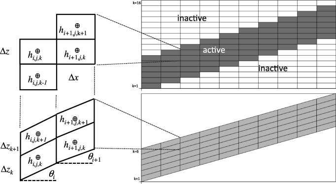

# Richards Equation Physics

This document describes the physics equations solved by ParFlow's Richards solver.  It starts with a summary of the model equations (e.g. Jones and Woodward, 2003; Kollet and Maxwell, 2006; Maxwell, 2013) similar to the User Manual, and then presents them in the residual, finite-volume form formulated the in source code. All equations include code references.

## Overview

ParFlow solves a **mass-conservative form** of the Richards equation for variably saturated subsurface flow, fully coupled with overland flow via the kinematic or diffusive wave approximation.

**Key source files:**
- [`nl_function_eval.c`](https://github.com/parflow/parflow/blob/master/pfsimulator/parflow_lib/nl_function_eval.c) - Residual function F(p)
- [`richards_jacobian_eval.c`](https://github.com/parflow/parflow/blob/master/pfsimulator/parflow_lib/richards_jacobian_eval.c) - Jacobian assembly
- [`overlandflow_eval.c`](https://github.com/parflow/parflow/blob/master/pfsimulator/parflow_lib/overlandflow_eval.c) - Original kinematic wave
- [`overlandflow_eval_Kin.c`](https://github.com/parflow/parflow/blob/master/pfsimulator/parflow_lib/overlandflow_eval_Kin.c) - Upwinded kinematic wave
- [`overlandflow_eval_diffusive.c`](https://github.com/parflow/parflow/blob/master/pfsimulator/parflow_lib/overlandflow_eval_diffusive.c) - Diffusive wave
- [`problem_saturation.c`](https://github.com/parflow/parflow/blob/master/pfsimulator/parflow_lib/problem_saturation.c) - Saturation constitutive models
- [`problem_phase_rel_perm.c`](https://github.com/parflow/parflow/blob/master/pfsimulator/parflow_lib/problem_phase_rel_perm.c) - Relative permeability models

---

## Theoretical Foundation

This section presents the continuous governing equations in standard form before their discretization in ParFlow.

### Conceptual Model

ParFlow solves integrated surface-subsurface flow using the mixed form of the 3D Richards equation and kinematic or diffusive approximations of the shallow water equations on either orthogonal or terrain-following grids. The figure below illustrates the key components using a terrain-following grid which is the most commonly used for watershed type applications:


*Figure: ParFlow terrain-following grid showing the land surface, vadose zone, and saturated subsurface. Grid layers conform to topography, with pressure head ($P$) and hydraulic head ($H = P + z$) defined at cell centers. Overland flow occurs at the land surface when pressure head exceeds zero; infiltration and exfiltration exchange water between surface and subsurface. Lateral subsurface flow is driven by hydraulic head gradients. (Adapted from Maxwell and Condon, 2016)*

**Things to note about ParFlow running in this mode for watershed applications:**
- **Integrated surface-subsurface flow**: The 3D Richards equation (subsurface) and 2D shallow water equations (overland flow) are solved implicitly together—all interactions are captured within a single timestep
- **Continuous pressure**: The same variable $h$ represents subsurface pressure head and surface ponding depth
- **Coupled land surface processes**: When using CLM, land-atmosphere exchanges (radiation, evapotranspiration, snow) are coupled via information passing at each timestep
- **Flexible gridding**: Supports both orthogonal grids and terrain-following grids (TFG) where layers parallel the land surface

### Notation and Sign Conventions

Throughout this document, we use consistent notation for the primary variables:

| Symbol | Name | Definition | Sign Convention |
|--------|------|------------|-----------------|
| $h$ | Pressure head | Static pressure as equivalent fluid column height: $h = P / (\rho g)$ | $h > 0$: saturated/ponded; $h < 0$: unsaturated |
| $\psi$ | Ponding depth | Surface water depth: $\psi = \max(h, 0)$ | $\psi \geq 0$ always |
| $z$ | Elevation head | Vertical position above datum | Increases upward |
| $H$ | Hydraulic head | Total head: $H = h + z$ | Fluid flows from high to low $H$ |
| $S_w$ | Water saturation | Fraction of pore space filled with water | $0 \leq S_w \leq 1$ |

**Pressure head definition:** Pressure head $h$ is the static fluid pressure $P$ expressed as the equivalent height of a fluid column:

$$h = \frac{P}{\gamma} = \frac{P}{\rho g}$$

where $\gamma = \rho g$ is the specific weight of water. In unsaturated conditions, $h < 0$ represents suction (matric potential).

**ParFlow unit conventions:** In most ParFlow applications, density ($\rho$) and gravity ($g$) are set to 1.0 (dimensionless). This simplifies the equations and means:
- **Pressure head** has units of length [L], typically meters
- **Permeability** ($K$) becomes equivalent to **saturated hydraulic conductivity** ($K_s$), with units [L T⁻¹] rather than [L²]
- The intrinsic relationship $K_s = K \rho g / \mu$ reduces to $K_s = K$ when $\rho = g = \mu = 1$

This convention is standard for single-phase, isothermal groundwater applications where relative density and viscosity variations are negligible.

**Key insight:** The variables $h$ and $\psi$ represent the same physical quantity at the land surface, but $\psi$ extracts only the ponded portion. When $h > 0$, water ponds at the surface and $\psi = h$. When $h < 0$, the surface is unsaturated and $\psi = 0$. This allows the same pressure variable to seamlessly transition between subsurface and surface flow regimes.  Note that we follow this convention and write Richards' Equation using $h$ and the Surface Water Equations using $\psi$.

### Richards' Equation

ParFlow solves the **mixed form** of Richards' equation for variably saturated flow:

$$S_s S_w(h) \frac{\partial h}{\partial t} + \phi \frac{\partial S_w(h)}{\partial t} = \nabla \cdot \mathbf{q} + q_r(\mathbf{x}, z)$$

where:
- $h$ = pressure head [L]
- $S_s$ = specific storage coefficient [L⁻¹]
- $S_w(h)$ = water saturation as a function of pressure head [-]
- $\phi$ = porosity [-]
- $\mathbf{q}$ = Darcy flux vector [L T⁻¹]
- $q_r$ = source/sink term [T⁻¹]

The two storage terms represent:
1. **Specific storage**: elastic storage from aquifer and fluid compressibility (dominant when saturated)
2. **Porosity storage**: changes in water content as the soil wets or dries (dominant when unsaturated)

### Darcy Flux

The subsurface flux follows the unsaturated Darcy's law (often called Darcy-Buckingham):

$$\mathbf{q} = -K_s(\mathbf{x}) \, k_r(h) \, \nabla(h + z)$$

where:
- $K_s(\mathbf{x})$ = saturated hydraulic conductivity tensor [L T⁻¹]
- $k_r(h)$ = relative permeability [-], function of pressure head
- $z$ = elevation head [L]
- $(h + z)$ = total hydraulic head [L]

### Terrain-Following Grid (TFG)

For domains with significant topography, ParFlow supports a terrain-following coordinate transformation. In TFG coordinates, the flux formulation becomes:

$$\mathbf{q} = -K_s(\mathbf{x}) \, k_r(h) \left[ \nabla(h + z) \cos\beta + \sin\beta \right]$$

where $\beta$ is the local terrain slope angle. This formulation:
- Aligns grid layers with topography
- Allows thin surface layers without extreme aspect ratios
- Properly accounts for gravity-driven flow along slopes

### Source and Sink Terms

The volumetric source/sink term $q_r$ includes:

**At the land surface:**
$$q_r(\mathbf{x}) = P(\mathbf{x}) - E(\mathbf{x})$$

where $P$ is precipitation and $E$ is evaporation.

**In the subsurface:**
$$q_r(\mathbf{x}, z) = -ET(\mathbf{x}, z)$$

where $ET$ is the distributed evapotranspiration sink (from root water uptake when coupled with CLM).

---

## Shallow Water Equations and Overland Flow

ParFlow couples subsurface flow with overland flow using a free-surface boundary condition at the land surface. This approach, introduced by Kollet and Maxwell (2006), uses **pressure continuity**—the same pressure variable $h$ represents both subsurface pressure head and surface ponding depth.

### Shallow Water Continuity

The depth-averaged continuity equation for overland flow is:

$$\frac{\partial \psi}{\partial t} = -\nabla \cdot (\psi \, \mathbf{v}) + q_{sb} + q_r$$

where:
- $\psi = \max(h, 0)$ = ponding depth [L]
- $\mathbf{v}$ = depth-averaged velocity vector [L T⁻¹]
- $q_{sb}$ = subsurface exchange flux [L T⁻¹]
- $q_r$ = rainfall/evaporation source [L T⁻¹]

### Manning's Equation

Velocities are computed using Manning's equation:

$$v = \frac{1}{n} \, R_h^{2/3} \, S_f^{1/2}$$

where:
- $n$ = Manning's roughness coefficient [T L⁻¹/³]
- $R_h \approx \psi$ = hydraulic radius (≈ depth for shallow overland flow) [L]
- $S_f$ = friction slope [-]

For 2D flow with directional slopes, the velocity in each direction is:

$$v_x = -\frac{S_{f,x}}{|S_f|^{1/2} \cdot n} \, \psi^{2/3}$$

$$v_y = -\frac{S_{f,y}}{|S_f|^{1/2} \cdot n} \, \psi^{2/3}$$

where $|S_f| = \sqrt{S_{f,x}^2 + S_{f,y}^2}$ is the friction slope magnitude.

### Integrated Overland Flow Boundary Condition

ParFlow integrates overland flow with subsurface flow through a **switchable boundary condition** at the land surface. When enabled, the top boundary of the Richards equation at the upper boundary becomes:

$$\mathbf{k} \cdot \left( -K_s \, k_r(h) \, \nabla(h + z) \right) = \frac{\partial \|\psi\|}{\partial t} - \nabla \cdot (\|\psi\| \, \mathbf{v}) + q_r(\mathbf{x})$$

where $\|\psi\| = \max(h, 0)$ extracts the ponding depth. This equation states that the vertical flux at the surface equals:
- Storage change in the ponded layer
- Plus divergence of lateral overland flow
- Plus direct precipitation/evaporation

**Key insight:** Both equations use the same pressure variable $h$. When $h > 0$, water ponds at the surface and flows laterally. When $h < 0$, the surface is unsaturated with no ponding. This integrated formulation—where surface and subsurface are solved implicitly together—captures all interactions within a single timestep.

---

## Three Overland Flow Formulations

ParFlow implements three overland flow formulations that differ in how they compute slopes and fluxes. All three solve the same underlying physics but with different numerical treatments.

### Notation

| Symbol | Description |
|--------|-------------|
| $\psi_{i,j}$ | Ponding depth at cell $(i,j)$ [L] |
| $S_{o,x}$, $S_{o,y}$ | Bed (topographic) slope in x, y directions [-] |
| $S_{f,x}$, $S_{f,y}$ | Friction slope in x, y directions [-] |
| $|S_f|$ | Friction slope magnitude: $\sqrt{S_{f,x}^2 + S_{f,y}^2}$ |
| $n$ | Manning's roughness coefficient [T L⁻¹/³] |
| $q_x$, $q_y$ | Flux per unit width in x, y directions [L² T⁻¹] |
| $\epsilon$ | Minimum slope magnitude (numerical floor) |

### 1. Original Kinematic Wave (`OverlandFlow`)

**Characteristics:**
- Cell-centered slope calculations
- Both pressure and slope are upwinded together
- Simpler formulation, original ParFlow implementation

**Slope calculation:**
$$S_{o,x_{i,j}} = \text{cell center slope}$$

**Flow direction:**
$$\text{dir}_x = -\text{sign}(S_{o,x})$$

**Flux calculation:**
$$q_{x_{i,j}} = \text{dir}_x \cdot \frac{\sqrt{|S_{o,x_{i,j}}|}}{n_{i,j}} \cdot \psi_{i,j}^{5/3}$$

**Face fluxes** (using upwind differences):
$$q_{e_{i,j}} = \max(q_{x_{i,j}}, 0) - \max(-q_{x_{i+1,j}}, 0)$$
$$q_{w_{i,j}} = \max(q_{x_{i-1,j}}, 0) - \max(-q_{x_{i,j}}, 0)$$

This formulation uses the bed slope $S_o$ directly as the friction slope (kinematic wave assumption: $S_f = S_o$).

### 2. Upwinded Kinematic Wave (`OverlandKinematic`)

**Characteristics:**
- Face-centered slope calculations
- Uses $S_f / |S_f|^{1/2}$ formulation for proper 2D vector decomposition
- Pressure is upwinded based on slope direction
- Manning's coefficient not upwinded
- **Recommended for most applications**

**Slope calculation** (at cell face $i+\frac{1}{2}$):
$$S_{o,x_{i,j}} = S_{o,x_{i+\frac{1}{2},j}} = \frac{E_{i+1,j} - E_{i,j}}{\Delta x}$$

**Friction slope** (kinematic: equals bed slope):
$$S_{f,x_{i,j}} = S_{o,x_{i,j}}$$

**Slope magnitude** (with numerical floor):
$$|S_f|_{i,j} = \max\left( \sqrt{S_{f,x_{i,j}}^2 + S_{f,y_{i,j}}^2}, \, \epsilon \right)$$

**Flux calculation:**
$$q_{x_{i,j}} = -\frac{S_{f,x_{i,j}}}{n_{i,j} \sqrt{|S_f|_{i,j}}} \cdot \psi_{uw_{i,i+1}}^{5/3}$$

where $\psi_{uw_{i,i+1}}$ is the **upwinded pressure**:
$$\psi_{uw_{i,i+1}} = \begin{cases} \max(\psi_i, 0) & \text{if } S_{f,x} < 0 \text{ (flow in +x direction)} \\ \max(\psi_{i+1}, 0) & \text{if } S_{f,x} \geq 0 \text{ (flow in -x direction)} \end{cases}$$

**Face flux assignment:**
$$q_{e_{i,j}} = q_{x_{i,j}}, \quad q_{w_{i,j}} = q_{x_{i-1,j}}$$
$$q_{n_{i,j}} = q_{y_{i,j}}, \quad q_{s_{i,j}} = q_{y_{i,j-1}}$$

### 3. Diffusive Wave (`OverlandDiffusive`)

**Characteristics:**
- Same as Upwinded Kinematic, but friction slope includes pressure gradient
- Slope magnitude uses **previous timestep** pressures for numerical stability
- Allows backwater effects (water can flow uphill against bed slope if ponding creates adverse pressure gradient)

**Slope calculation** (same as kinematic):
$$S_{o,x_{i,j}} = \frac{E_{i+1,j} - E_{i,j}}{\Delta x}$$

**Friction slope** (includes water surface gradient):
$$S_{f,x_{i,j}}^t = S_{o,x_{i,j}} + \frac{\psi_{i+1,j}^t - \psi_{i,j}^t}{\Delta x}$$

**Slope magnitude** (using previous timestep for stability):
$$|S_f|_{i,j}^t = \max\left( \sqrt{\left(S_{f,x_{i,j}}^{t-1}\right)^2 + \left(S_{f,y_{i,j}}^{t-1}\right)^2}, \, \epsilon \right)$$

**Flux calculation:**
$$q_{x_{i,j}}^t = -\frac{S_{f,x_{i,j}}^t}{n_{i,j} \sqrt{|S_f|_{i,j}^t}} \cdot \left(\psi_{uw_{i,i+1}}^t\right)^{5/3}$$

**Key difference from kinematic:** The friction slope $S_f$ now depends on the water surface gradient, not just topography. This enables:
- Backwater effects behind obstructions
- Flow on flat terrain driven by ponding gradients
- More physically realistic behavior for lakes and reservoirs

### Comparison of Formulations

| Aspect | Original KWE | Upwinded KWE | Diffusive Wave |
|--------|--------------|--------------|----------------|
| Slope location | Cell center | Face center | Face center |
| Friction slope | $S_f = S_o$ | $S_f = S_o$ | $S_f = S_o + \nabla\psi$ |
| Pressure upwinding | With slope | Independent | Independent |
| Slope magnitude time | Current | Current | Previous |
| Backwater effects | No | No | Yes |
| Flat terrain flow | No | No | Yes |
| BC Type | `OverlandFlow` | `OverlandKinematic` | `OverlandDiffusive` |

### Configuration

See [Boundary Conditions keys](https://parflow.readthedocs.io/en/latest/keys.html#boundary-conditions-pressure) and [Richards Solver keys](https://parflow.readthedocs.io/en/latest/keys.html#richards-equation-solver-parameters) in the ParFlow manual.

```python
# Original kinematic wave (legacy)
run.Patch.top.BCPressure.Type = 'OverlandFlow'

# Upwinded kinematic wave (recommended)
run.Patch.top.BCPressure.Type = 'OverlandKinematic'
run.Solver.OverlandKinematic.Epsilon = 1.0e-5

# Diffusive wave (for backwater/reservoir applications)
run.Patch.top.BCPressure.Type = 'OverlandDiffusive'
run.Solver.OverlandDiffusive.Epsilon = 1.0e-5
```

---

## Solution Approach

ParFlow solves the coupled governing equations using an **implicit, fully-coupled Newton-Krylov method**. This section provides a brief overview; see [Richards Solver Documentation](Richards_Solver.md) for complete details on solver configuration and troubleshooting.

### Residual Formulation

Rather than solving the PDEs directly, ParFlow formulates the problem as finding the pressure field $h$ that satisfies:

$$\mathbf{F}(h) = \mathbf{0}$$

where $\mathbf{F}$ is the **residual function**—a vector containing one equation per grid cell. Each component $F_i$ represents the mass balance error for cell $i$: if $F_i = 0$, conservation is satisfied.

The residual combines:
- **Subsurface terms**: Storage change + flux divergence + sources (Richards equation)
- **Surface terms**: Ponding storage + overland flux divergence + rainfall (shallow water equation)
- **Coupling**: Continuous pressure at the land surface links both domains

### Newton-Krylov Iteration

At each timestep, ParFlow applies Newton's method:

1. **Evaluate residual**: Compute $\mathbf{F}(h^k)$ for current iterate $h^k$
2. **Solve linear system**: Find update $\delta h$ from $\mathbf{J} \, \delta h = -\mathbf{F}(h^k)$
3. **Update solution**: $h^{k+1} = h^k + \delta h$
4. **Check convergence**: Repeat until $\|\mathbf{F}\| < \epsilon$

The Jacobian matrix $\mathbf{J} = \partial \mathbf{F} / \partial h$ is solved using a **Krylov method** (GMRES) with **multigrid preconditioning** (PFMG or SMG from HYPRE). This combination efficiently handles the large, sparse, ill-conditioned systems arising from heterogeneous subsurface properties.

### Implicit Time Stepping

ParFlow uses **backward Euler** (fully implicit) time discretization:

$$\frac{h^{n+1} - h^n}{\Delta t} = f(h^{n+1})$$

All spatial terms are evaluated at the new time level $n+1$, making the scheme unconditionally stable. Adaptive time stepping adjusts $\Delta t$ based on convergence behavior.

### Key Implementation Files

| Component | File | Description |
|-----------|------|-------------|
| Residual evaluation | [`nl_function_eval.c`](https://github.com/parflow/parflow/blob/master/pfsimulator/parflow_lib/nl_function_eval.c) | Computes $\mathbf{F}(h)$ |
| Jacobian assembly | [`richards_jacobian_eval.c`](https://github.com/parflow/parflow/blob/master/pfsimulator/parflow_lib/richards_jacobian_eval.c) | Computes $\mathbf{J}$ |
| Nonlinear solver | [`kinsol_nonlin_solver.c`](https://github.com/parflow/parflow/blob/master/pfsimulator/parflow_lib/kinsol_nonlin_solver.c) | Newton iteration via SUNDIALS KINSOL |
| Linear solver | [`pf_pfmg.c`](https://github.com/parflow/parflow/blob/master/pfsimulator/parflow_lib/pf_pfmg.c), [`pf_smg.c`](https://github.com/parflow/parflow/blob/master/pfsimulator/parflow_lib/pf_smg.c) | HYPRE multigrid preconditioners |
| Time stepping | [`solver_richards.c`](https://github.com/parflow/parflow/blob/master/pfsimulator/parflow_lib/solver_richards.c) | Outer time loop, adaptive $\Delta t$ |

For solver configuration options, convergence troubleshooting, and performance tuning, see [Richards Solver Documentation](Richards_Solver.md).

---

## Discrete Formulation

This section describes the discrete equations as implemented in ParFlow's source code. All equations include code examples for verification.

### Grid Coordinate System

ParFlow uses a **cell-centered finite volume** discretization. All primary variables (pressure, saturation, porosity, etc.) are defined at **cell centers**. Fluxes are computed at cell faces.

ParFlow supports two grid types:
- **Orthogonal grid**: Standard rectangular cells with uniform $\Delta z$ per layer
- **Terrain-following grid (TFG)**: Cells conform to topography with variable $\Delta z_k$ and slope angles $\theta$



*Figure: Comparison of orthogonal (top-left) and terrain-following (bottom-left) grid stencils showing pressure head $h_{i,j,k}$ at cell centers (⊕). Right panels show active (white) and inactive (gray) cells in a TFG domain. (Maxwell, 2013, Fig. 1)*

#### Orthogonal vs Terrain-Following Grids

| Aspect | Orthogonal Grid | Terrain-Following Grid |
|--------|-----------------|------------------------|
| Cell shape | Rectangular | Parallelogram |
| Layer thickness | Uniform $\Delta z$ | Variable $\Delta z_k$ per column |
| Slope handling | Implicit in head gradient | Explicit slope angles $\theta_i$ |
| Typical use | Flat terrain, small domains | Complex topography, large domains |

#### Plan View (X-Y at constant k)

```
    y (j)
      ^
      |
   ny +--+--+--+--+--+--+
      |  |  |  |  |  |  |
      +--+--+--+--+--+--+
      |  |  |  | ⊕|  |  |    ⊕ = cell center (i,j,k)
      +--+--+--+--+--+--+        where h_{i,j,k} is defined
      |  |  |  |  |  |  |
      +--+--+--+--+--+--+
      |  |  |  |  |  |  |
    0 +--+--+--+--+--+--+------> x (i)
      0              nx

    Cell (i,j) has:
      - Center at (i+0.5, j+0.5) * (Δx, Δy)
      - West face shared with cell (i-1, j)
      - East face shared with cell (i+1, j)
      - South face shared with cell (i, j-1)
      - North face shared with cell (i, j+1)
```

#### Cross-Section View (X-Z at constant j)

**Orthogonal grid:**
```
    z (k)
      ^
      |  Land Surface
   nz +--+--+--+--+--+--+  k = nz-1 (top layer)
      |  |  |  |  |  |  |
      +--+--+--+--+--+--+  k = nz-2
  Δz  |  |  | ⊕|  |  |  |    ⊕ = cell center (i,j,k)
      +--+--+--+--+--+--+        where h_{i,j,k} is defined
      |  |  |  |  |  |  |
      +--+--+--+--+--+--+  k = 1
      |  |  |  |  |  |  |
    0 +--+--+--+--+--+--+------> x (i)
      0      Δx      nx
      Bottom of domain       k = 0 (bottom layer)
```

**Terrain-following grid:**
```
    z                        Land Surface
      ^                    __/
      |               ____/    k = nz-1
      |          ____/  /  /
      |     ____/  /  /  /     Cells follow topography
      |____/  /  /  /  /
      |  /  /  /  /  /         k = 1
      | /  /  /  /  /
    0 +--+--+--+--+--+--------> x (i)
      0              nx
      Bottom (flat)            k = 0

    Layer thickness varies: Δz_k at column i may differ from Δz_k at column i+1
    Slope angle θ_i affects flux calculations between columns
```

**Key conventions:**
- **Origin**: Lower-left corner of the bottom layer (i=0, j=0, k=0)
- **z-direction**: Increases upward; k=0 is the bottom, k=nz-1 is the land surface
- **Cell centers**: Pressure head $h_{i,j,k}$, saturation $S_{i,j,k}$, etc. defined at cell centers
- **Face fluxes**: $q_{i+1/2}$ computed at interface between cells $i$ and $i+1$
- **Right-hand rule**: x × y = z (thumb points up)

#### Active and Inactive Cells

In terrain-following grids, the computational domain is a thin layer that follows topography. Cells above and below this active zone are marked **inactive** and excluded from the solve:

```
    k=16  ████████░░░░░░░░░░░░░░░░████████
          ████████████░░░░░░░░████████████   ████ = inactive
    k=8   ████████████████░░████████████████  ░░░░ = active
          ░░░░░░░░████████████████░░░░░░░░
    k=1   ░░░░░░░░░░░░████████░░░░░░░░░░░░
          ─────────────────────────────────> x (i)
```

**Benefits of active/inactive masking:**
- Computational domain tracks land surface with minimal layers
- Avoids wasting cells on deep bedrock or air above terrain
- Enables continental-scale simulations with thin subsurface domains

**Configuration:**
```python
# Enable terrain-following grid
run.Solver.TerrainFollowingGrid = True

# Provide DEM-derived slope files
run.TopoSlopesX.Type = 'PFBFile'
run.TopoSlopesX.FileName = 'slope_x.pfb'
run.TopoSlopesY.Type = 'PFBFile'
run.TopoSlopesY.FileName = 'slope_y.pfb'
```

#### Computational Stencil

The 7-point stencil for cell $(i,j,k)$ involves the cell center and fluxes across all six faces. Pressure head $h_{i,j,k}$ is defined at cell centers (marked ⊕).

**Orthogonal stencil (X-Z cross-section):**
```
                    ┌─────────────┐
                    │             │
                    │  h_{i,j,k+1}│
              Δz    │      ⊕      │
                    │             │
        ┌───────────┼─────────────┼───────────┐
        │           │             │           │
        │ h_{i-1,j,k}│  h_{i,j,k}  │ h_{i+1,j,k}│
        │     ⊕     │      ⊕      │     ⊕     │
        │           │             │           │
        └───────────┼─────────────┼───────────┘
                    │             │
                    │  h_{i,j,k-1}│
                    │      ⊕      │
                    │             │
                    └─────────────┘
                          Δx

    5-point stencil in X-Z plane (+ 2 neighbors in Y for full 7-point)
```

**Terrain-following stencil (X-Z cross-section):**
```
                        ╱─────────────╲
                       ╱               ╲
              Δz_{k+1}╱   h_{i,j,k+1}   ╲
                     ╱        ⊕         ╲
        ┌───────────╱─────────────────────╲───────────┐
        │          ╱                       ╲          │
        │h_{i-1,j,k}        h_{i,j,k}       h_{i+1,j,k}│
        │    ⊕    ╱            ⊕            ╲    ⊕    │
        │        ╱     θ_i          θ_{i+1}  ╲        │
        └───────╱───────────────────────────────╲─────┘
         Δz_k  ╱         h_{i,j,k-1}             ╲
              ╱              ⊕                    ╲
             ╱─────────────────────────────────────╲

    Slope angles θ_i, θ_{i+1} affect gravity terms in flux calculation
    Layer thicknesses Δz_k, Δz_{k+1} may vary between columns
```

**Flux sign convention:** Positive flux is in the positive coordinate direction (+x, +y, +z). The residual for cell $(i,j,k)$ accumulates:
- Outgoing fluxes (east, north, upper): added to $F_{i,j,k}$
- Those same fluxes enter neighbors: subtracted from $F_{i+1,j,k}$, $F_{i,j+1,k}$, $F_{i,j,k+1}$

### Subsurface Residual

ParFlow solves the governing equations using a Newton-Krylov method. The discrete residual for each cell represents the mass balance error—when $F_i = 0$, conservation is satisfied.

**Complete residual function** ([`nl_function_eval.c`](https://github.com/parflow/parflow/blob/master/pfsimulator/parflow_lib/nl_function_eval.c), `NlFunctionEval()`):

$$F_i = \underbrace{(S_i \rho_i - S_i^{n} \rho_i^{n}) \phi_i V_i}_{\text{porosity storage}} + \underbrace{S_{s,i} V_i (p_i S_i \rho_i - p_i^{n} S_i^{n} \rho_i^{n})}_{\text{specific storage}} + \underbrace{\Delta t \sum_{faces} q_f}_{\text{net flux}} - \underbrace{\Delta t \, V_i (Q_i + ET_i)}_{\text{sources}}$$

where superscript $n$ denotes previous timestep values.

#### 1. Porosity Storage Term

**Physics:** Change in water volume due to saturation changes (dominant in unsaturated zone).

**Equation:**
$$(S \rho - S^n \rho^n) \phi \, V$$

**Code** ([`nl_function_eval.c`](https://github.com/parflow/parflow/blob/master/pfsimulator/parflow_lib/nl_function_eval.c), `NlFunctionEval()` porosity storage section):
```c
fp[ip] = (sp[ip] * dp[ip] - osp[ip] * odp[ip])
       * pop[ipo] * vol * z_mult_dat[ip];
```

where:
- `sp`, `osp` = current and old saturation
- `dp`, `odp` = current and old density
- `pop` = porosity
- `vol = dx * dy * dz` = base cell volume
- `z_mult_dat[ip]` = variable dz multiplier (see [Variable dz](#variable-dz-multiplier))

#### 2. Specific Storage Term

**Physics:** Elastic storage from aquifer compressibility (dominant in saturated zone).

**Equation:**
$$S_s \, V \, (p \, S \, \rho - p^n S^n \rho^n)$$

**Code** ([`nl_function_eval.c`](https://github.com/parflow/parflow/blob/master/pfsimulator/parflow_lib/nl_function_eval.c), `NlFunctionEval()` specific storage section):
```c
fp[ip] += ss[ip] * vol * z_mult_dat[ip]
        * (pp[ip] * sp[ip] * dp[ip] - opp[ip] * osp[ip] * odp[ip]);
```

where:
- `ss` = specific storage coefficient
- `pp`, `opp` = current and old pressure

#### 3. Source/Sink Terms

**Physics:** External sources (wells, recharge) and sinks (evapotranspiration).

**Equation:**
$$-V \, \Delta t \, (Q + ET)$$

**Code** ([`nl_function_eval.c`](https://github.com/parflow/parflow/blob/master/pfsimulator/parflow_lib/nl_function_eval.c), `NlFunctionEval()` source/sink section):
```c
fp[ip] -= vol * z_mult_dat[ip] * dt * (sp[ip] + et[ip]);
```

where:
- `sp` = source term (from wells, recharge)
- `et` = evapotranspiration sink (from CLM coupling)
- Note: negative sign because sources reduce the residual

#### 4. Face Flux Terms

**Physics:** Net flux into cell from all six faces.

**Equation:**
$$\Delta t \, (q_{right} + q_{front} + q_{upper} - q_{left} - q_{back} - q_{lower})$$

**Code** ([`nl_function_eval.c`](https://github.com/parflow/parflow/blob/master/pfsimulator/parflow_lib/nl_function_eval.c), `NlFunctionEval()` flux accumulation):
```c
// Add flux contributions to residual
PlusEquals(fp[ip], dt * (u_right + u_front + u_upper));
PlusEquals(fp[ip + 1], -dt * u_right);       // right neighbor
PlusEquals(fp[ip + sy_p], -dt * u_front);    // front neighbor
PlusEquals(fp[ip + sz_p], -dt * u_upper);    // upper neighbor
```

**X-direction (right face) flux** ([`nl_function_eval.c`](https://github.com/parflow/parflow/blob/master/pfsimulator/parflow_lib/nl_function_eval.c), `NlFunctionEval()` x-flux calculation):
```c
double diff_l = pp[ip] - pp[ip + 1];  // pressure difference
double updir = (diff_l / dx) * x_dir_g_c - x_dir_g;  // upwind direction

// Pressure gradient contribution
double u_right = z_mult_dat[ip] * ffx
    * PMean(pp[ip], pp[ip + 1], permxp[ip], permxp[ip + 1])  // harmonic mean K
    * (diff_l / dx) * x_dir_g_c
    * RPMean(updir, 0.0, rpp[ip] * dp[ip], rpp[ip + 1] * dp[ip + 1])  // upstream kr*rho
    / viscosity;

// Gravity contribution (for terrain-following grid)
u_right += z_mult_dat[ip] * ffx
    * PMean(pp[ip], pp[ip + 1], permxp[ip], permxp[ip + 1])
    * (-x_dir_g)  // sin(slope)
    * RPMean(updir, 0.0, rpp[ip] * dp[ip], rpp[ip + 1] * dp[ip + 1])
    / viscosity;
```

**Z-direction (upper face) flux** ([`nl_function_eval.c`](https://github.com/parflow/parflow/blob/master/pfsimulator/parflow_lib/nl_function_eval.c), `NlFunctionEval()` z-flux calculation):
```c
// Separation distance accounting for variable dz
double sep_l = dz * Mean(z_mult_dat[ip], z_mult_dat[ip + sz_p]);

// Driving head at lower cell (includes gravity)
double lower_cond_l = pp[ip] / sep_l
    - (z_mult_dat[ip] / (z_mult_dat[ip] + z_mult_dat[ip + sz_p]))
    * dp[ip] * gravity;

// Driving head at upper cell
double upper_cond_l = pp[ip + sz_p] / sep_l
    + (z_mult_dat[ip + sz_p] / (z_mult_dat[ip] + z_mult_dat[ip + sz_p]))
    * dp[ip + sz_p] * gravity;

// Vertical flux
double u_upper = ffz
    * PMeanDZ(permzp[ip], permzp[ip + sz_p], z_mult_dat[ip], z_mult_dat[ip + sz_p])
    * (lower_cond_l - upper_cond_l)
    * RPMean(lower_cond_l, upper_cond_l, rpp[ip] * dp[ip], rpp[ip + sz_p] * dp[ip + sz_p])
    / viscosity;
```

### Variable Definitions

| Symbol | Description | Units | Code Variable |
|--------|-------------|-------|---------------|
| $p$ | Pressure | [L] | `pp` |
| $S$ | Water saturation | [-] | `sp` |
| $\rho$ | Fluid density | [-] or [M L⁻³] | `dp` |
| $\phi$ | Porosity | [-] | `pop` |
| $S_s$ | Specific storage | [L⁻¹] | `ss` |
| $K$ | Intrinsic permeability | [L²] | `permxp`, `permyp`, `permzp` |
| $k_r$ | Relative permeability | [-] | `rpp` |
| $\mu$ | Dynamic viscosity | [M L⁻¹ T⁻¹] | `viscosity` |
| $g$ | Gravitational constant | [L T⁻²] | `gravity` |
| $V$ | Cell volume | [L³] | `vol * z_mult_dat` |

---

## Fluid Properties

### Density

**Location:** [`problem_phase_density.c`](https://github.com/parflow/parflow/blob/master/pfsimulator/parflow_lib/problem_phase_density.c)

Two density models are available:

**Type 0: Constant** (`ConstantPhaseDensity()`)
$$\rho = \rho_0$$

**Type 1: Equation of State** (`EquationOfStatePhaseDensity()`)
$$\rho(p) = \rho_{ref} \exp(c \cdot p)$$

where $c$ is the compressibility constant.

**Configuration:** See [Phase keys](https://parflow.readthedocs.io/en/latest/keys.html#phases) in the ParFlow manual.

```python
# Constant density (typical for most applications)
run.Phase.water.Density.Type = 'Constant'
run.Phase.water.Density.Value = 1.0  # Relative density (dimensionless)

# Compressible density (rarely used)
run.Phase.water.Density.Type = 'EquationOfState'
run.Phase.water.Density.ReferenceDensity = 1.0
run.Phase.water.Density.CompressibilityConstant = 1.0e-8
```

**Note:** In most ParFlow applications, density is set to 1.0 (dimensionless relative density), and the code effectively solves a volume balance. The compressible equation of state (Type 1) exists but is rarely used in practice.

### Viscosity

**Location:** [`problem_phase_viscosity.c`](https://github.com/parflow/parflow/blob/master/pfsimulator/parflow_lib/problem_phase_viscosity.c)

Currently only constant viscosity is supported:

```python
run.Phase.water.Viscosity.Type = 'Constant'
run.Phase.water.Viscosity.Value = 1.0  # Relative viscosity (dimensionless)
```

---

## Face Flux Computation

### Horizontal Fluxes (x and y directions)

**Location:** [`nl_function_eval.c`](https://github.com/parflow/parflow/blob/master/pfsimulator/parflow_lib/nl_function_eval.c), `NlFunctionEval()` horizontal flux section

For the x-direction flux between cells $i$ and $i+1$:

```c
// Pressure gradient term
u_right = z_mult_dat[ip] * ffx * del_y_slope
        * PMean(pp[ip], pp[ip + 1], permxp[ip], permxp[ip + 1])
        * (diff / (dx * del_x_slope)) * x_dir_g_c
        * RPMean(updir, 0.0, rpp[ip] * dp[ip], rpp[ip + 1] * dp[ip + 1])
        / viscosity;

// Gravity term (for terrain-following grid)
u_right += z_mult_dat[ip] * ffx * del_y_slope
         * PMean(pp[ip], pp[ip + 1], permxp[ip], permxp[ip + 1])
         * (-x_dir_g)
         * RPMean(updir, 0.0, rpp[ip] * dp[ip], rpp[ip + 1] * dp[ip + 1])
         / viscosity;
```

**Discrete flux formula:**

$$q_x = A_x \cdot z_{mult} \cdot \bar{K}_x \cdot \overline{k_r \rho} \cdot \frac{1}{\mu} \left[ \frac{p_i - p_{i+1}}{\Delta x} \cos\theta_x - g \sin\theta_x \right]$$

where:
- $A_x = \Delta y \cdot \Delta z$ (face area, variable `ffx`)
- $\bar{K}_x$ = harmonic mean permeability
- $\overline{k_r \rho}$ = upstream-weighted relative permeability × density
- $\theta_x$ = terrain slope angle (zero for non-TFG)

### Vertical Flux (z-direction)

**Location:** [`nl_function_eval.c`](https://github.com/parflow/parflow/blob/master/pfsimulator/parflow_lib/nl_function_eval.c), `NlFunctionEval()` vertical flux section

The vertical flux uses a different formulation to handle variable $\Delta z$:

```c
// Separation distance
double sep_l = dz * (Mean(z_mult_dat[ip], z_mult_dat[ip + sz_p]));

// Driving head terms
double lower_cond_l = pp[ip] / sep_l
    - (z_mult_dat[ip] / (z_mult_dat[ip] + z_mult_dat[ip + sz_p]))
    * dp[ip] * gravity * z_dir_g;

double upper_cond_l = pp[ip + sz_p] / sep_l
    + (z_mult_dat[ip + sz_p] / (z_mult_dat[ip] + z_mult_dat[ip + sz_p]))
    * dp[ip + sz_p] * gravity * z_dir_g;

// Flux calculation
double u_upper = ffz * PMeanDZ(...) * (lower_cond_l - upper_cond_l)
               * RPMean(lower_cond_l, upper_cond_l, rpp[ip]*dp[ip], rpp[ip+sz_p]*dp[ip+sz_p])
               / viscosity;
```

**Discrete flux formula:**

$$q_z = A_z \cdot \bar{K}_z \cdot \overline{k_r \rho} \cdot \frac{1}{\mu} \cdot (L_{lower} - L_{upper})$$

where:
$$L_{lower} = \frac{p_i}{\Delta z_{sep}} - w_i \rho_i g$$
$$L_{upper} = \frac{p_{i+1}}{\Delta z_{sep}} + w_{i+1} \rho_{i+1} g$$
$$\Delta z_{sep} = \Delta z \cdot \frac{z_{mult,i} + z_{mult,i+1}}{2}$$
$$w_i = \frac{z_{mult,i}}{z_{mult,i} + z_{mult,i+1}}$$

### Averaging Operators

**Location:** [`nl_function_eval.c`](https://github.com/parflow/parflow/blob/master/pfsimulator/parflow_lib/nl_function_eval.c), macro definitions at top of file

```c
#define PMean(a, b, c, d)    HarmonicMean(c, d)      // Permeability
#define RPMean(a, b, c, d)   UpstreamMean(a, b, c, d) // Relative perm × density
#define Mean(a, b)           ArithmeticMean(a, b)     // General
```

**Harmonic mean (permeability):**
$$\bar{K} = \frac{2 K_i K_{i+1}}{K_i + K_{i+1}}$$

**Upstream mean (relative permeability):**
$$\overline{k_r \rho} = \begin{cases}
(k_r \rho)_i & \text{if flow direction is } i \to i+1 \\
(k_r \rho)_{i+1} & \text{if flow direction is } i+1 \to i
\end{cases}$$

The flow direction is determined by comparing the driving head terms.

---

## Saturation Constitutive Models

**Location:** [`problem_saturation.c`](https://github.com/parflow/parflow/blob/master/pfsimulator/parflow_lib/problem_saturation.c)

### Van Genuchten (Default)

**Code:** [`problem_saturation.c`](https://github.com/parflow/parflow/blob/master/pfsimulator/parflow_lib/problem_saturation.c), `VanGenuchtenSaturation()`

```c
if (ppdat[ipp] >= 0.0)
  psdat[ips] = s_dif + s_res;  // Saturated
else {
  double head = fabs(ppdat[ipp]) / (pddat[ipd] * gravity);
  psdat[ips] = s_dif / pow(1.0 + pow((alpha * head), n), m) + s_res;
}
```

**Equations:**

For $p \geq 0$ (saturated): $S = S_{sat}$

For $p < 0$ (unsaturated):
$$S(h) = \frac{S_{sat} - S_r}{[1 + (\alpha h)^n]^m} + S_r$$

where:
- $h = |p| / (\rho g)$ is pressure head [L]
- $m = 1 - 1/n$
- $\alpha$ is the air entry parameter [L⁻¹]
- $n$ is the pore size distribution index [-]
- $S_r$ is residual saturation [-]
- $S_{sat}$ is saturated saturation [-]

**Derivative** (for Jacobian):
$$\frac{dS}{dh} = \frac{m \cdot n \cdot \alpha \cdot (\alpha h)^{n-1} \cdot (S_{sat} - S_r)}{[1 + (\alpha h)^n]^{m+1}}$$

**Configuration:** See [Saturation keys](https://parflow.readthedocs.io/en/latest/keys.html#saturation) in the ParFlow manual.

```python
run.Geom.domain.Saturation.Type = 'VanGenuchten'
run.Geom.domain.Saturation.Alpha = 3.5      # [1/m]
run.Geom.domain.Saturation.N = 2.0          # [-]
run.Geom.domain.Saturation.SRes = 0.1       # [-] Residual saturation
run.Geom.domain.Saturation.SSat = 1.0       # [-] Saturated saturation
```

### Haverkamp

**Code:** [`problem_saturation.c`](https://github.com/parflow/parflow/blob/master/pfsimulator/parflow_lib/problem_saturation.c), `HaverkampSaturation()`

$$S(h) = \frac{A \cdot (S_{sat} - S_r)}{A + h^\beta} + S_r$$

**Configuration:**
```python
run.Geom.domain.Saturation.Type = 'Haverkamp'
run.Geom.domain.Saturation.A = 1.611e6
run.Geom.domain.Saturation.gamma = 3.96
```

---

## Relative Permeability Models

**Location:** [`problem_phase_rel_perm.c`](https://github.com/parflow/parflow/blob/master/pfsimulator/parflow_lib/problem_phase_rel_perm.c)

### Van Genuchten-Mualem (Default)

**Code:** [`problem_phase_rel_perm.c`](https://github.com/parflow/parflow/blob/master/pfsimulator/parflow_lib/problem_phase_rel_perm.c), `VanGenuchtenPhaseRelPerm()`

```c
double head = fabs(ppdat[ipp]) / (pddat[ipd] * gravity);
double opahn = 1.0 + pow(alpha * head, n);
double ahnm1 = pow(alpha * head, n - 1);
prdat[ipr] = pow(1.0 - ahnm1 / (pow(opahn, m)), 2) / pow(opahn, (m / 2));
```

**Equation:**
$$k_r(h) = \frac{\left[1 - \frac{(\alpha h)^{n-1}}{[1 + (\alpha h)^n]^m}\right]^2}{[1 + (\alpha h)^n]^{m/2}}$$

For $p \geq 0$: $k_r = 1$

**Performance optimization:** ParFlow uses lookup tables with spline interpolation to avoid expensive power function evaluations. See `VanGenuchtenPhaseRelPermInitInstanceXtra()` for table initialization.

**Configuration:** See [Relative Permeability keys](https://parflow.readthedocs.io/en/latest/keys.html#relative-permeability) in the ParFlow manual.

```python
run.Geom.domain.RelPerm.Type = 'VanGenuchten'
run.Geom.domain.RelPerm.Alpha = 3.5      # [1/m] - should match saturation
run.Geom.domain.RelPerm.N = 2.0          # [-] - should match saturation
run.Geom.domain.RelPerm.NumSamplePoints = 10000  # Lookup table size
```

---

## Terrain-Following Grid (TFG)

**Location:** [`nl_function_eval.c`](https://github.com/parflow/parflow/blob/master/pfsimulator/parflow_lib/nl_function_eval.c), `NlFunctionEval()` TFG slope calculation section

When `Solver.TerrainFollowingGrid = True`, horizontal fluxes include slope-dependent gravity terms.

### Slope Formulations

Three options controlled by `Solver.TerrainFollowingGrid.SlopeUpwindFormulation`:

```c
switch (public_xtra->tfgupwind) {
  case 0:  // Default (Maxwell 2013)
    x_dir_g = Mean(gravity * sin(atan(x_ssl_dat[io])),
                   gravity * sin(atan(x_ssl_dat[io + 1])));
    x_dir_g_c = Mean(gravity * cos(atan(x_ssl_dat[io])),
                     gravity * cos(atan(x_ssl_dat[io + 1])));
    break;
  case 1:  // Direct upwinding with trig
    x_dir_g = gravity * sin(atan(x_ssl_dat[io]));
    x_dir_g_c = gravity * cos(atan(x_ssl_dat[io]));
    break;
  case 2:  // Direct upwinding, no trig
    x_dir_g = x_ssl_dat[io];
    x_dir_g_c = 1.0;
    break;
}
```

**Modified flux equation:**
$$q_x = \bar{K} \cdot \overline{k_r \rho} \cdot \frac{1}{\mu} \left[ \frac{\Delta p}{\Delta x} \cos\theta - g \sin\theta \right]$$

**Configuration:** See [Terrain Following Grid keys](https://parflow.readthedocs.io/en/latest/keys.html#terrain-following-grid) and [Topographic Slopes keys](https://parflow.readthedocs.io/en/latest/keys.html#topographic-slopes) in the ParFlow manual.

```python
run.Solver.TerrainFollowingGrid = True
run.Solver.TerrainFollowingGrid.SlopeUpwindFormulation = 'Original'  # or 'Upwind', 'UpwindNoTrig'

# Provide slope data
run.TopoSlopesX.Type = 'PFBFile'
run.TopoSlopesX.FileName = 'slope_x.pfb'
run.TopoSlopesY.Type = 'PFBFile'
run.TopoSlopesY.FileName = 'slope_y.pfb'
```

### Variable dz Multiplier

ParFlow supports variable vertical cell thickness through the `z_mult` multiplier field. The actual cell thickness at layer $k$ is:

$$\Delta z_k = \Delta z_{base} \times z_{mult,k}$$

where $\Delta z_{base}$ is the base cell size specified by `ComputationalGrid.DZ`.

#### Layer Indexing Convention

Layer indices start at **0 at the bottom** and increase upward, matching the k-index:

```
    z
    ^
    |   +------------------+
    |   |  k = nz-1 (_9)   |  ← Land surface (top)
    |   +------------------+
    |   |  k = nz-2 (_8)   |
    |   +------------------+
    |   |       ...        |
    |   +------------------+
    |   |  k = 1   (_1)    |
    |   +------------------+
    |   |  k = 0   (_0)    |  ← Bottom of domain
    +---+------------------+

  dzScale index = k index
    Cell._0 → k = 0 (bottom)
    Cell._1 → k = 1
    ...
    Cell._(nz-1) → k = nz-1 (surface)
```

#### Example: Thin Surface Layers

A common configuration uses thin layers near the surface for better vadose zone resolution. With `nz = 10` layers:

```python
run.Solver.Nonlinear.VariableDz = True
run.dzScale.Type = 'nzList'
run.dzScale.nzListNumber = 10  # Must match ComputationalGrid.NZ

# Layer indices match k: _0 = bottom (k=0), _9 = surface (k=nz-1)
run.Cell._0.dzScale.Value = 1.0     # k=0, bottom layer
run.Cell._1.dzScale.Value = 0.5     # k=1
run.Cell._2.dzScale.Value = 0.25    # k=2
run.Cell._3.dzScale.Value = 0.125   # k=3
run.Cell._4.dzScale.Value = 0.05    # k=4
run.Cell._5.dzScale.Value = 0.025   # k=5
run.Cell._6.dzScale.Value = 0.005   # k=6
run.Cell._7.dzScale.Value = 0.003   # k=7
run.Cell._8.dzScale.Value = 0.0015  # k=8
run.Cell._9.dzScale.Value = 0.0005  # k=9, surface layer (thinnest)
```

If `ComputationalGrid.DZ = 200.0` meters (total depth / nz), the actual layer thicknesses would be:
- Bottom layer (_0): 200.0 m
- Layer _1: 100.0 m
- ...progressively thinner toward surface...
- Surface layer (_9): 0.1 m

This configuration is typical for continental-scale simulations where high vertical resolution is needed near the land surface for accurate ET and infiltration, while deeper layers can be coarser.

#### Code Usage

In the residual computation, `z_mult_dat[ip]` multiplies the base volume:

```c
// Actual cell volume = base_volume * z_mult
vol = dx * dy * dz;  // base volume
fp[ip] = (sp[ip] * dp[ip] - osp[ip] * odp[ip])
       * pop[ipo] * vol * z_mult_dat[ip];  // z_mult scales volume
```

For vertical fluxes, the separation distance between cell centers accounts for variable dz:

```c
// Average of neighboring z_mult values
double sep_l = dz * Mean(z_mult_dat[ip], z_mult_dat[ip + sz_p]);
```

---

## Overland Flow Implementation Details

This section provides code-level implementation details for the overland flow formulations described in [Three Overland Flow Formulations](#three-overland-flow-formulations).

**Key source files:**
- [`overlandflow_eval.c`](https://github.com/parflow/parflow/blob/master/pfsimulator/parflow_lib/overlandflow_eval.c) - Original kinematic wave (legacy)
- [`overlandflow_eval_Kin.c`](https://github.com/parflow/parflow/blob/master/pfsimulator/parflow_lib/overlandflow_eval_Kin.c) - Upwinded kinematic wave
- [`overlandflow_eval_diffusive.c`](https://github.com/parflow/parflow/blob/master/pfsimulator/parflow_lib/overlandflow_eval_diffusive.c) - Diffusive wave approximation
- [`nl_function_eval.c`](https://github.com/parflow/parflow/blob/master/pfsimulator/parflow_lib/nl_function_eval.c) - Surface-subsurface coupling

---

### Slope Definition and Sign Convention

**Location:** [`problem_toposlope_x.c`](https://github.com/parflow/parflow/blob/master/pfsimulator/parflow_lib/problem_toposlope_x.c), [`problem_toposlope_y.c`](https://github.com/parflow/parflow/blob/master/pfsimulator/parflow_lib/problem_toposlope_y.c)

ParFlow defines topographic slopes as the **gradient of elevation** in each direction:

$$S_x = \frac{\partial z}{\partial x} = \frac{z_{i+1} - z_i}{\Delta x}$$
$$S_y = \frac{\partial z}{\partial y} = \frac{z_{j+1} - z_j}{\Delta y}$$

**Sign convention:**
- $S_x > 0$: Elevation **increases** in the +x direction (terrain rises toward +x)
- $S_x < 0$: Elevation **decreases** in the +x direction (terrain descends toward +x)

**Flow direction:** Water flows **downhill**, so flow is in the **opposite direction** to positive slope:
- When $S_x > 0$, flow is in the **-x direction** (flow direction = -1)
- When $S_x < 0$, flow is in the **+x direction** (flow direction = +1)

**Code example** ([`overlandflow_eval.c`](https://github.com/parflow/parflow/blob/master/pfsimulator/parflow_lib/overlandflow_eval.c), `OverlandFlowEval()` flow direction logic):
```c
if (sx_dat[io + ii] > 0.0)
  xdir = -1.0;    // Slope rises in +x, so water flows in -x
else if (sx_dat[io + ii] < 0.0)
  xdir = 1.0;     // Slope falls in +x, so water flows in +x
else
  xdir = 0.0;     // Flat terrain, no flow
```

**Configuration:**
```python
# Constant slope (e.g., 0.1% grade descending in +x direction)
run.TopoSlopesX.Type = 'Constant'
run.TopoSlopesX.GeomNames = 'domain'
run.TopoSlopesX.Geom.domain.Value = -0.001  # Negative = descending in +x

# From file (computed from DEM)
run.TopoSlopesX.Type = 'PFBFile'
run.TopoSlopesX.FileName = 'slope_x.pfb'
run.TopoSlopesY.Type = 'PFBFile'
run.TopoSlopesY.FileName = 'slope_y.pfb'
```

---

### Finite Volume Discretization

**Reference:** [Kollet and Maxwell (2006)](https://www.sciencedirect.com/science/article/abs/pii/S0309170805002101), Eq. 12-14

ParFlow uses a **cell-centered finite volume** discretization for overland flow. Each cell has four face fluxes:

```
           kn (north)
              ↑
              |
    kw ← [i,j] → ke
              |
              ↓
           ks (south)
```

**Face flux assignment** ([`overlandflow_eval_Kin.c`](https://github.com/parflow/parflow/blob/master/pfsimulator/parflow_lib/overlandflow_eval_Kin.c), `OverlandFlowEvalKin()` face flux section):
```c
ke_v[io] = qx_v[io];        // East flux = flux at cell's east face
kw_v[io] = qx_v[io - 1];    // West flux = neighbor's east face
kn_v[io] = qy_v[io];        // North flux = flux at cell's north face
ks_v[io] = qy_v[io - sy_v]; // South flux = neighbor's north face
```

**Flux divergence** (from [`nl_function_eval.c`](https://github.com/parflow/parflow/blob/master/pfsimulator/parflow_lib/nl_function_eval.c), overland boundary condition section):

$$\nabla \cdot \mathbf{q} = \frac{q_E - q_W}{\Delta x} + \frac{q_N - q_S}{\Delta y}$$

where $q_E$, $q_W$, $q_N$, $q_S$ are the **volumetric fluxes** [L²/T] at each face.

**Upwind flux formulation** ([`overlandflow_eval.c`](https://github.com/parflow/parflow/blob/master/pfsimulator/parflow_lib/overlandflow_eval.c), `OverlandFlowEval()` upwind section):

For the original formulation, face fluxes are computed using upwind differencing:
```c
kw_v[io] = pfmax(q_v[0], 0.0) - pfmax(-q_v[1], 0.0);
ke_v[io] = pfmax(q_v[1], 0.0) - pfmax(-q_v[2], 0.0);
```

This separates positive (outflow) and negative (inflow) contributions at each face:
- `pfmax(q, 0)` captures outflow from the upstream cell
- `pfmax(-q, 0)` captures inflow from the downstream cell

**Upstream weighting for depth** (RPMean macro):

The cell-centered kinematic formulation ([`overlandflow_eval_Kin.c`](https://github.com/parflow/parflow/blob/master/pfsimulator/parflow_lib/overlandflow_eval_Kin.c)) uses the `RPMean` macro for upstream weighting:

```c
Press_x = RPMean(-Sf_x, 0.0, pfmax((PP_ip), 0.0), pfmax((PP_ipp1), 0.0));
```

This selects the ponding depth from the upwind cell based on slope direction:
- If $-S_x > 0$ (flow in +x direction): use depth from cell $i$
- If $-S_x < 0$ (flow in -x direction): use depth from cell $i+1$

---

### Kinematic Wave Code Details

**Reference:** [Kollet and Maxwell (2006)](https://www.sciencedirect.com/science/article/abs/pii/S0309170805002101), Eq. 9-11

See [Three Overland Flow Formulations](#three-overland-flow-formulations) for theoretical background. The kinematic wave assumes friction slope equals bed slope ($S_f = S_0$). ParFlow implements two versions:

#### Original Formulation ([`overlandflow_eval.c`](https://github.com/parflow/parflow/blob/master/pfsimulator/parflow_lib/overlandflow_eval.c), `OverlandFlowEval()`)

```c
if (sx_dat[io + ii] > 0.0)
  xdir = -1.0;
else if (sx_dat[io + ii] < 0.0)
  xdir = 1.0;
else
  xdir = 0.0;

q_v[ii + 1] = xdir * (RPowerR(fabs(sx_dat[io + ii]), 0.5) / mann_dat[io + ii])
              * RPowerR(pfmax((pp[ip]), 0.0), (5.0 / 3.0));
```

**Equation:**
$$q = \text{dir}(S) \cdot \frac{|S|^{1/2}}{n} \cdot h^{5/3}$$

where $\text{dir}(S) = \text{sign}(-S)$ gives flow direction opposite to slope.

#### Cell-Centered Formulation ([`overlandflow_eval_Kin.c`](https://github.com/parflow/parflow/blob/master/pfsimulator/parflow_lib/overlandflow_eval_Kin.c), `OverlandFlowEvalKin()`)

This is the recommended formulation (BCPressure Type = `OverlandKinematic`):

```c
Sf_x = sx_dat[io];
Sf_y = sy_dat[io];

Sf_mag = RPowerR(Sf_x * Sf_x + Sf_y * Sf_y, 0.5);
if (Sf_mag < ov_epsilon)
  Sf_mag = ov_epsilon;

Press_x = RPMean(-Sf_x, 0.0, pfmax((PP_ip), 0.0), pfmax((PP_ipp1), 0.0));
Press_y = RPMean(-Sf_y, 0.0, pfmax((PP_ip), 0.0), pfmax((PP_ippsy), 0.0));

qx_v[io] = -(Sf_x / (RPowerR(fabs(Sf_mag), 0.5) * mann_dat[io]))
           * RPowerR(Press_x, (5.0 / 3.0));
qy_v[io] = -(Sf_y / (RPowerR(fabs(Sf_mag), 0.5) * mann_dat[io]))
           * RPowerR(Press_y, (5.0 / 3.0));
```

**Equations:**
$$q_x = -\frac{S_x}{|S_{mag}|^{1/2} \cdot n} \cdot h_{up}^{5/3}$$
$$q_y = -\frac{S_y}{|S_{mag}|^{1/2} \cdot n} \cdot h_{up}^{5/3}$$

where:
- $S_x, S_y$ = topographic slopes (positive = descending in +x, +y direction)
- $S_{mag} = \sqrt{S_x^2 + S_y^2}$ clamped to minimum `ov_epsilon`
- $h_{up}$ = upstream-weighted ponding depth: $\max(p, 0)$ from upwind cell
- $n$ = Manning's roughness coefficient [T L⁻¹/³]

**Relationship to standard Manning:** The standard 1D Manning equation is:
$$q = \frac{|S|^{1/2}}{n} h^{5/3}$$

ParFlow's 2D formulation decomposes this into directional components by using $S_x / |S_{mag}|^{1/2}$ and $S_y / |S_{mag}|^{1/2}$, which ensures the total flux magnitude matches Manning's equation while providing correct flow direction.

---

### Diffusive Wave Code Details

**Reference:** [Maxwell (2013)](https://www.sciencedirect.com/science/article/abs/pii/S0309170812002114)

**Location:** [`overlandflow_eval_diffusive.c`](https://github.com/parflow/parflow/blob/master/pfsimulator/parflow_lib/overlandflow_eval_diffusive.c), `OverlandFlowEvalDiff()` friction slope calculation

See [Three Overland Flow Formulations](#three-overland-flow-formulations) for theoretical background. The diffusive wave includes pressure gradients in the friction slope:

```c
Pdown = pfmax(pp[ip], 0.0);
Pupx = pfmax(pp[ipp1], 0.0);
Pupy = pfmax(pp[ippsy], 0.0);

// Friction slope = bed slope + water surface gradient
Sf_x = sx_dat[io] + (Pupx - Pdown) / dx;
Sf_y = sy_dat[io] + (Pupy - Pdown) / dy;

// Use old timestep slope magnitude for stability
Sf_xo = sx_dat[io] + (Pupox - Pdowno) / dx;
Sf_yo = sy_dat[io] + (Pupoy - Pdowno) / dy;
Sf_mag = RPowerR(Sf_xo * Sf_xo + Sf_yo * Sf_yo, 0.5);

Press_x = RPMean(-Sf_x, 0.0, pfmax((pp[ip]), 0.0), pfmax((pp[ipp1]), 0.0));
qx_v[io] = -(Sf_x / (RPowerR(fabs(Sf_mag), 0.5) * mann_dat[io]))
           * RPowerR(Press_x, (5.0 / 3.0));
```

**Equations:**
$$S_{f,x} = S_{0,x} + \frac{h_{i+1} - h_i}{\Delta x}$$
$$S_{f,y} = S_{0,y} + \frac{h_{j+1} - h_j}{\Delta y}$$

$$q_x = -\frac{S_{f,x}}{|S_{f,mag}^{n-1}|^{1/2} \cdot n} \cdot h_{up}^{5/3}$$

**Key difference from kinematic:** The friction slope now includes the water surface gradient, allowing backwater effects. The slope magnitude uses **previous timestep values** for numerical stability.

**Configuration:**
```python
run.Patch.top.BCPressure.Type = 'OverlandDiffusive'
run.Solver.OverlandDiffusive.Epsilon = 1.0e-5
```

---

### Seepage Face Boundary Condition

**Location:** [`nl_function_eval.c`](https://github.com/parflow/parflow/blob/master/pfsimulator/parflow_lib/nl_function_eval.c), `NlFunctionEval()` seepage BC section; [`seepage.c`](https://github.com/parflow/parflow/blob/master/pfsimulator/parflow_lib/seepage.c)

The seepage face is a boundary condition for hillslope discharge where water drains freely when pressure exceeds zero. Unlike overland flow routing, the seepage face simply removes excess water locally without lateral redistribution.

**Physical interpretation:**

A seepage face represents the outflow boundary of a hillslope or aquifer where groundwater emerges at the surface. The boundary condition enforces:

1. **If $p > 0$:** Water seeps out at a rate proportional to the excess pressure head
2. **If $p \leq 0$:** No flux (the boundary is "dry")

This is analogous to a Dirichlet condition ($p = 0$) when saturated, but allows the boundary to become unsaturated.

**Code implementation** ([`nl_function_eval.c`](https://github.com/parflow/parflow/blob/master/pfsimulator/parflow_lib/nl_function_eval.c), seepage residual contribution):
```c
// FrontFace (top surface) seepage contribution
q_overlnd = (vol / dz) * dt * (pfmax(pp[ip], 0.0) - 0.0);
fp[ip] += q_overlnd;
```

**Residual contribution:**
$$F_{seepage} = \frac{V}{\Delta z} \cdot \Delta t \cdot \max(p, 0)$$

where $V = \Delta x \cdot \Delta y$ is the cell area.

**Comparison with overland flow:**

| Aspect | Seepage Face | Overland Flow |
|--------|--------------|---------------|
| Lateral routing | None | Manning's equation |
| Storage term | No change in storage | $(h^{n+1} - h^n)$ term |
| Flux divergence | No | $(q_E - q_W)/\Delta x + (q_N - q_S)/\Delta y$ |
| Use case | Hillslope outlets, drains | Overland runoff routing |

**Seepage patch detection** ([`seepage.c`](https://github.com/parflow/parflow/blob/master/pfsimulator/parflow_lib/seepage.c), `SeepageNewPublicXtra()`):

Seepage patches are identified by the `BCPressure.Seepage` key. The code builds a lookup table of patch IDs:

```c
sprintf(key, "Patch.%s.BCPressure.Seepage", patch_name);
char *switch_name = GetStringDefault(key, "False");
int seepage_flag = NA_NameToIndexExitOnError(switch_na, switch_name, key);
if (seepage_flag) {
  seepage->seepage_patches[patch_id] = 1;
}
```

**Configuration:**
```python
# Define a seepage face at the outlet patch
run.Patch.outlet.BCPressure.Type = 'OverlandKinematic'
run.Patch.outlet.BCPressure.Seepage = True
run.Patch.outlet.BCPressure.Cycle = 'constant'
run.Patch.outlet.BCPressure.alltime.Value = 0.0  # No additional flux

# Seepage can also be used with constant flux BC
run.Patch.hillslope_outlet.BCPressure.Type = 'FluxConst'
run.Patch.hillslope_outlet.BCPressure.Seepage = True
```

**Note:** When `Seepage = True`, the seepage face behavior is **added** to whatever BC type is specified. The `OverlandKinematic` type is commonly used because it provides the overland flow infrastructure, but with seepage the lateral routing is bypassed.

---

### Surface-Subsurface Coupling

**Reference:** [Kollet and Maxwell (2006)](https://www.sciencedirect.com/science/article/abs/pii/S0309170805002101), Eq. 12-14

**Location:** [`nl_function_eval.c`](https://github.com/parflow/parflow/blob/master/pfsimulator/parflow_lib/nl_function_eval.c), `NlFunctionEval()` overland BC section

The key innovation of ParFlow's approach is treating overland flow as a boundary condition rather than a separate model. The surface and subsurface share **continuous pressure** at the ground surface.

```c
// Overland contribution to top cell residual
q_overlnd = vol * (pfmax(pp[ip], 0.0) - pfmax(opp[ip], 0.0)) / dz
          + dt * vol * ((ke_[io] - kw_[io]) / dx + (kn_[io] - ks_[io]) / dy) / dz
          + vol * dt / dz * (exp(pfmin(pp[ip], 0.0) * SpinupDampP1) * SpinupDampP2);

// Add to residual
fp[ip] += q_overlnd;

// Rainfall source
u_new = u_new * bc_patch_values[ival];  // Rainfall rate
fp[ip] += dt * dir * u_new;
```

**Complete coupling equation for top cell:**

$$F_{top} = \underbrace{F_{subsurface}}_{\text{Richards residual}} + \underbrace{\frac{V}{\Delta z}(h^{n+1} - h^n)}_{\text{ponding storage}} + \underbrace{\frac{\Delta t \cdot V}{\Delta z}\left(\frac{q_E - q_W}{\Delta x} + \frac{q_N - q_S}{\Delta y}\right)}_{\text{lateral flux divergence}} + \underbrace{\frac{\Delta t \cdot V}{\Delta z} R}_{\text{rainfall source}} + \underbrace{\frac{V \Delta t}{\Delta z} e^{p \cdot P_1} P_2}_{\text{spinup damping}}$$

where:
- $V = \Delta x \cdot \Delta y$ (cell area, since this is a 2D surface term)
- $h = \max(p, 0)$ = ponding depth [L]
- $q_E, q_W, q_N, q_S$ = face fluxes from overland module [L²/T]
- $R$ = rainfall rate [L/T], negative = into domain
- $P_1, P_2$ = spinup damping parameters (optional, for model initialization)

**Physical interpretation:**
1. **Pressure continuity:** When $p > 0$ at the surface, water ponds (overland flow). When $p < 0$, the surface is unsaturated
2. **Implicit coupling:** Both subsurface and surface equations are solved simultaneously in the Newton iteration
3. **No conductance layer:** Unlike traditional approaches, there is no artificial resistance between surface and subsurface

---

### Overland Flow Jacobian Derivatives

**Location:** [`overlandflow_eval_Kin.c`](https://github.com/parflow/parflow/blob/master/pfsimulator/parflow_lib/overlandflow_eval_Kin.c), `OverlandFlowEvalKinDer()` (kinematic); [`overlandflow_eval_diffusive.c`](https://github.com/parflow/parflow/blob/master/pfsimulator/parflow_lib/overlandflow_eval_diffusive.c), `OverlandFlowEvalDiffDer()` (diffusive)

For Newton convergence, the Jacobian requires $\partial q / \partial h$:

**Kinematic wave derivative:**
```c
qx_temp = -(5.0 / 3.0) * (Sf_x / (RPowerR(fabs(Sf_mag), 0.5) * mann_dat[io]))
        * RPowerR(Press_x, (2.0 / 3.0));
```

$$\frac{\partial q_x}{\partial h} = -\frac{5}{3} \cdot \frac{S_x}{|S_{mag}|^{1/2} \cdot n} \cdot h^{2/3}$$

**Diffusive wave derivative:** More complex due to $S_f$ dependence on $h$:

$$\frac{\partial q_x}{\partial h_i} = \frac{5}{3} \cdot \frac{(-S_{0,x} - h_{i+1}/\Delta x)}{|S_{f,mag}|^{1/2} \cdot n} \cdot h_i^{2/3} + \frac{8}{3} \cdot \frac{h_i^{5/3}}{|S_{f,mag}|^{1/2} \cdot n \cdot \Delta x}$$

---

### Boundary Condition Types Summary

| Type | Code | Description | Routing |
|------|------|-------------|---------|
| `OverlandFlow` | 7 | Legacy kinematic (constant rainfall) | `overlandflow_eval.c` |
| `OverlandFlowPFB` | 8 | Kinematic with rainfall from file | `overlandflow_eval.c` |
| `SeepageFace` | 9 | Free drainage, no routing | None |
| `OverlandKinematic` | 10 | Cell-centered kinematic | `overlandflow_eval_Kin.c` |
| `OverlandDiffusive` | 11 | Diffusive wave | `overlandflow_eval_diffusive.c` |

---

### Configuration Examples

**Basic kinematic wave:** See [Manning's Roughness keys](https://parflow.readthedocs.io/en/latest/keys.html#manning-s-roughness-coefficients) in the ParFlow manual.

```python
run.Patch.top.BCPressure.Type = 'OverlandKinematic'
run.Patch.top.BCPressure.Cycle = 'constant'
run.Patch.top.BCPressure.alltime.Value = -0.001  # Rainfall [m/hr], negative = into domain

run.Mannings.Type = 'Constant'
run.Mannings.Value = 5.0e-5  # [hr/m^(1/3)]

run.TopoSlopesX.Type = 'PFBFile'
run.TopoSlopesX.FileName = 'slope_x.pfb'
run.TopoSlopesY.Type = 'PFBFile'
run.TopoSlopesY.FileName = 'slope_y.pfb'

run.Solver.OverlandKinematic.Epsilon = 1.0e-5  # Minimum slope magnitude
```

**Diffusive wave with spatially-variable Manning's:**
```python
run.Patch.top.BCPressure.Type = 'OverlandDiffusive'

run.Mannings.Type = 'PFBFile'
run.Mannings.FileName = 'mannings.pfb'

run.Solver.OverlandDiffusive.Epsilon = 1.0e-5
```

**Seepage face at hillslope outlet:**
```python
run.Patch.outlet.BCPressure.Type = 'OverlandKinematic'
run.Patch.outlet.BCPressure.Seepage = True
run.Patch.outlet.BCPressure.Cycle = 'constant'
run.Patch.outlet.BCPressure.alltime.Value = 0.0
```

---

### Spinup Damping

**Location:** [`nl_function_eval.c`](https://github.com/parflow/parflow/blob/master/pfsimulator/parflow_lib/nl_function_eval.c), `NlFunctionEval()` spinup damping term

For model initialization, exponential damping can accelerate equilibration:

```c
vol * dt / dz * (exp(pfmin(pp[ip], 0.0) * SpinupDampP1) * SpinupDampP2);
```

This adds a flux proportional to $e^{p \cdot P_1} \cdot P_2$ when $p < 0$, helping drain initially over-saturated cells.

**Configuration:**
```python
run.Solver.OverlandFlowSpinUp = 1
run.Solver.OverlandSpinupDampP1 = 10.0   # Damping rate
run.Solver.OverlandSpinupDampP2 = 0.001  # Damping amplitude
```

---

## Source and Sink Terms

### Evapotranspiration (CLM Coupling)

**Location:** [`nl_function_eval.c`](https://github.com/parflow/parflow/blob/master/pfsimulator/parflow_lib/nl_function_eval.c), `NlFunctionEval()` source/sink section

```c
fp[ip] -= vol * z_mult_dat[ip] * dt * (sp[ip] + et[ip]);
```

The ET flux from CLM appears as a volumetric sink:

$$F_i \mathrel{-}= V_i \cdot \Delta t \cdot ET_i$$

where $ET_i$ [T⁻¹] is computed by CLM based on atmospheric forcing and soil moisture stress.

### Wells

**Location:** [`well_package.c`](https://github.com/parflow/parflow/blob/master/pfsimulator/parflow_lib/well_package.c), [`problem_phase_source.c`](https://github.com/parflow/parflow/blob/master/pfsimulator/parflow_lib/problem_phase_source.c)

Wells can be pressure-controlled or flux-controlled. See [Wells keys](https://parflow.readthedocs.io/en/latest/keys.html#wells) in the ParFlow manual.

```python
run.Wells.Names = 'extraction_well'
run.Wells.extraction_well.Type = 'Flux'
run.Wells.extraction_well.Action = 'Extraction'
run.Wells.extraction_well.X = 50.0
run.Wells.extraction_well.Y = 50.0
run.Wells.extraction_well.ZLower = 5.0
run.Wells.extraction_well.ZUpper = 10.0
run.Wells.extraction_well.Method = 'Standard'
run.Wells.extraction_well.Cycle = 'constant'
run.Wells.extraction_well.alltime.Flux.water.Value = -0.001  # [L³/T]
```

---

## Specific Storage

**Location:** [`problem_spec_storage.c`](https://github.com/parflow/parflow/blob/master/pfsimulator/parflow_lib/problem_spec_storage.c)

Specific storage accounts for elastic storage:

$$S_s = \rho g (\alpha_m + \phi \beta_w)$$

where:
- $\alpha_m$ = matrix compressibility
- $\beta_w$ = water compressibility

**Contribution to residual** ([`nl_function_eval.c`](https://github.com/parflow/parflow/blob/master/pfsimulator/parflow_lib/nl_function_eval.c), `NlFunctionEval()` specific storage section):
$$F_i \mathrel{+}= S_{s,i} V_i (p_i S_i \rho_i - p_i^n S_i^n \rho_i^n)$$

**Configuration:** See [Specific Storage keys](https://parflow.readthedocs.io/en/latest/keys.html#specific-storage) in the ParFlow manual.

```python
run.SpecificStorage.Type = 'Constant'
run.SpecificStorage.GeomNames = 'domain'
run.Geom.domain.SpecificStorage.Value = 1.0e-4  # [1/m]
```

---

## Porosity

**Location:** [`problem_porosity.c`](https://github.com/parflow/parflow/blob/master/pfsimulator/parflow_lib/problem_porosity.c)

**Configuration:** See [Porosity keys](https://parflow.readthedocs.io/en/latest/keys.html#porosity) in the ParFlow manual.

```python
run.Geom.domain.Porosity.Type = 'Constant'
run.Geom.domain.Porosity.Value = 0.4

# Or from file
run.Geom.domain.Porosity.Type = 'PFBFile'
run.Geom.domain.Porosity.FileName = 'porosity.pfb'
```

---

## Permeability

**Location:** [`problem_permeability.c`](https://github.com/parflow/parflow/blob/master/pfsimulator/parflow_lib/problem_permeability.c)

**Configuration:** See [Permeability keys](https://parflow.readthedocs.io/en/latest/keys.html#permeability) in the ParFlow manual.

```python
# Isotropic constant
run.Geom.domain.Perm.Type = 'Constant'
run.Geom.domain.Perm.Value = 1.0e-4  # [m²] or [m/hr] depending on unit system

# Anisotropic
run.Perm.TensorType = 'TensorByGeom'
run.Geom.domain.Perm.TensorValX = 1.0
run.Geom.domain.Perm.TensorValY = 1.0
run.Geom.domain.Perm.TensorValZ = 0.1

# From file
run.Geom.domain.Perm.Type = 'PFBFile'
run.Geom.domain.Perm.FileName = 'perm.pfb'
```

---

## Boundary Condition Types

**Location:** [`bc_pressure.h`](https://github.com/parflow/parflow/blob/master/pfsimulator/parflow_lib/bc_pressure.h), [`bc_pressure_package.c`](https://github.com/parflow/parflow/blob/master/pfsimulator/parflow_lib/bc_pressure_package.c)

See [Boundary Conditions keys](https://parflow.readthedocs.io/en/latest/keys.html#boundary-conditions-pressure) in the ParFlow manual.

| Type | Code | Description |
|------|------|-------------|
| `DirEquilRefPatch` | 0 | Hydrostatic equilibrium from reference |
| `DirEquilPLinear` | 1 | Piecewise linear pressure |
| `FluxConst` | 2 | Constant flux |
| `FluxVolumetric` | 3 | Volumetric flux |
| `PressureFile` | 4 | Pressure from PFB file |
| `FluxFile` | 5 | Flux from PFB file |
| `ExactSolution` | 6 | Analytical test functions |
| `OverlandFlow` | 7 | Overland with constant rainfall |
| `OverlandFlowPFB` | 8 | Overland with rainfall from file |
| `SeepageFace` | 9 | Seepage face |
| `OverlandKinematic` | 10 | Kinematic wave (same as 7) |
| `OverlandDiffusive` | 11 | Diffusive wave |

---

## Unit System

ParFlow uses a consistent unit system. Common choices:

| Quantity | SI Units | Common ParFlow Units |
|----------|----------|---------------------|
| Length | m | m |
| Time | s | hr |
| Pressure | Pa | m (head) |
| Permeability | m² | m/hr (hydraulic conductivity) |
| Density | kg/m³ | 1.0 (relative) |
| Viscosity | Pa·s | 1.0 (relative) |
| Gravity | m/s² | 1.0 (normalized) |

When using relative density/viscosity = 1.0 and normalized gravity = 1.0, the permeability effectively becomes saturated hydraulic conductivity $K_s$ [L/T].

---

## References

### Core ParFlow Papers

1. **Jones, J.E., & Woodward, C.S. (2001)**. Newton-Krylov-multigrid solvers for large-scale, highly heterogeneous, variably saturated flow problems. *Advances in Water Resources*, 24(7), 763-774. [doi:10.1016/S0309-1708(00)00075-0](https://doi.org/10.1016/S0309-1708(00)00075-0)
   - Introduces the Newton-Krylov solver with multigrid preconditioning used in ParFlow

2. **Kollet, S.J., & Maxwell, R.M. (2006)**. Integrated surface-groundwater flow modeling: A free-surface overland flow boundary condition in a parallel groundwater flow model. *Advances in Water Resources*, 29(7), 945-958. [doi:10.1016/j.advwatres.2005.08.006](https://doi.org/10.1016/j.advwatres.2005.08.006)
   - Introduces the continuous pressure surface-subsurface coupling
   - Kinematic wave overland flow formulation

3. **Maxwell, R.M. (2013)**. A terrain-following grid transform and preconditioner for parallel, large-scale, integrated hydrologic modeling. *Advances in Water Resources*, 53, 109-117. [doi:10.1016/j.advwatres.2012.10.001](https://doi.org/10.1016/j.advwatres.2012.10.001)
   - Terrain-following grid (TFG) formulation
   - Diffusive wave overland flow

4. **Kuffour, B.N.O., Engdahl, N.B., Woodward, C.S., Condon, L.E., Kollet, S., & Maxwell, R.M. (2020)**. Simulating coupled surface-subsurface flows with ParFlow v3.5.0: capabilities, applications, and ongoing development of an open-source, massively parallel, integrated hydrologic model. *Geoscientific Model Development*, 13, 1373-1397. [doi:10.5194/gmd-13-1373-2020](https://doi.org/10.5194/gmd-13-1373-2020)
   - Comprehensive overview of ParFlow capabilities

### Constitutive Relations

5. **van Genuchten, M.T. (1980)**. A closed-form equation for predicting the hydraulic conductivity of unsaturated soils. *Soil Science Society of America Journal*, 44(5), 892-898.
   - Van Genuchten saturation-pressure relationship

6. **Mualem, Y. (1976)**. A new model for predicting the hydraulic conductivity of unsaturated porous media. *Water Resources Research*, 12(3), 513-522.
   - Mualem relative permeability model

### Additional Resources

7. **ParFlow Documentation**: [https://parflow.readthedocs.io/](https://parflow.readthedocs.io/)
8. **ParFlow GitHub**: [https://github.com/parflow/parflow](https://github.com/parflow/parflow)
