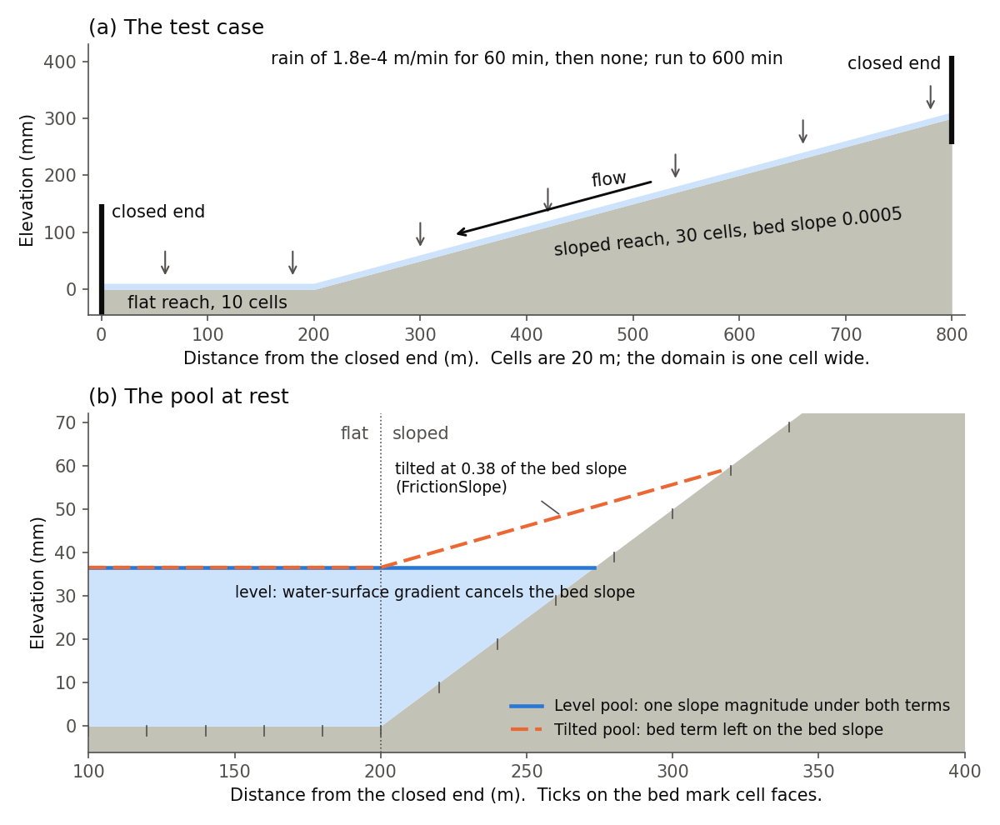

.. _Model_Equations:

Model Equations
===============

In this chapter, we discuss the model equations used by ParFlow for its
fully and variably saturated flow, overland flow, and multiphase flow
and transport models. First, section :ref:`Steady-State, Saturated Groundwater Flow` describes
steady-state, groundwater flow (specified by solver **IMPES**). Next,
section :ref:`Richards' Equation` describes the Richards’ equation
model (specified by solver **RICHARDS**) for variably saturated flow as
implemented in ParFlow. Section :ref:`TFG` describes the terrain
following grid formulation. Next, the overland flow equations are
presented in section :ref:`Overland Flow`. In section
:ref:`Multi-Phase Flow Equations` we describe the multi-phase flow
equations (specified by solver **IMPES**), and in section
:ref:`Transport Equations` we describe the transport equations.
Finally, section :ref:`Notation and Units` presents some notation
and units and section :ref:`Water Balance` presents some basic water
balance equations.

.. _Steady-State, Saturated Groundwater Flow:

Steady-State, Saturated Groundwater Flow
----------------------------------------

Many groundwater problems are solved assuming steady-state,
fully-saturated groundwater flow. This follows the form often written
as:

.. math::
   :label: ssgw
   
   \begin{aligned}
   \nabla \cdot\textbf{q} = Q(x)
   \end{aligned}
   

where :math:`Q` is the spatially-variable source-sink term (to represent
wells, etc) and :math:`\textbf{q}` is the Darcy flux
:math:`[L^{2}T^{-1}]` which is commonly written as:

.. math::
   :label: darcy

   \begin{aligned}
   \textbf{q}=- \textbf{K} \nabla H
   \end{aligned}

where :math:`\textbf{K}` is the saturated, hydraulic conductivity tensor
:math:`[LT^{-1}]` and :math:`H` :math:`[L]` is the head-potential.
Inspection of :eq:`eqn-mass-balance` and
:eq:`eqn-darcy` show that these equations agree with the
above formulation for a single-phase (:math:`i=1`), fully-saturated
(:math:`S_i=S=1`), problem where the mobility, :math:`{\lambda}_i`, is
set to the saturated hydraulic conductivity, :math:`\textbf{K}`, below.
This is accomplished by setting the relative permeability and viscosity
terms to unity in :eq:`eqn-phase-mobility` as well
as the gravity and density terms in :eq:`eqn-darcy`. This
is shown in the example in :ref:`Tutorial`, but please note that
the resulting solution is in pressure-head, :math:`h`, not head
potential, :math:`H`, and will still contain a hydrostatic pressure
gradient in the :math:`z` direction.

.. _Richards' Equation:

Richards’ Equation
------------------

The form of Richards’ equation implemented in ParFlow is given as,

.. math::
   :label: richard

   \begin{aligned}
   S(p)S_s\frac{\partial p}{\partial t} -
   \frac{\partial (S(p)\rho(p)\phi)}{\partial t}
   - \nabla \cdot(\textbf{K}(p)\rho(p)(\nabla p - \rho(p) {\vec g})) = Q, \;  {\rm in} \; \Omega,
   \end{aligned}

where :math:`\Omega` is the flow domain, :math:`p` is the pressure-head
of water :math:`[L]`, :math:`S` is the water saturation, :math:`S_s` is
the specific storage coefficient :math:`[L^{-1}]`, :math:`\phi` is the
porosity of the medium, :math:`\textbf{K}(p)` is the hydraulic
conductivity tensor :math:`[LT^{-1}]`, and :math:`Q` is the water
source/sink term :math:`[L^{3}T^{-1}]` (includes wells and surface
fluxes). The hydraulic conductivity can be written as,

.. math::
   :label: hydcond

   \begin{aligned}
   K(p) =  \frac{{\bar k} k_r(p) \rho g}{\mu},
   \end{aligned}

where :math:`\bar k` is the intrinsic permeability tensor, :math:`k_r(p)` is
the relative permeability, :math:`\rho` is the density, :math:`g` is the
gravitational acceleration, and :math:`\mu` is the viscosity.

Boundary conditions can be stated as,

.. math::
   :label: bcd

   \begin{align}
   p & = & p_D, \; {\rm on} \; \Gamma^D, \\
   -K(p)\nabla p \cdot {\bf n} & = &
   g_N, \; {\rm on} \; \Gamma^N,
   \end{align}

where :math:`\Gamma^D \cup \Gamma^N = \partial \Omega`,
:math:`\Gamma^D \neq \emptyset`, and :math:`{\bf n}` is an outward
pointing, unit, normal vector to :math:`\Omega`. This is the mixed form
of Richards’ equation. Note here that due to the constant (or passive)
air phase pressure assumption, Richards’ equation ignores the air phase
except through its effects on the hydraulic conductivity, :math:`K`. An
initial condition,

.. math::
   :label: initcond

   \begin{aligned}
   p = p^0(x), \; t = 0,
   \end{aligned}

completes the specification of the problem.

.. _TFG:

Terrain Following Grid
----------------------

The terrain following grid formulation transforms the ParFlow grid to
conform to topography :cite:p:`M13`. This alters the form of
Darcy’s law to include a topographic slope component:

.. math::
   :label: darcyTFG

   \begin{aligned}
   q_x=\textbf{K}(p)\rho(p)(\frac{\partial p}{\partial x}\cos \theta_x + \sin \theta_x)
   \end{aligned}

where :math:`\theta_x = \arctan(S_0,x)` and
:math:`\theta_y = \arctan(S_0,y)` which are assumed to be the same as
the **TopoSlope** keys assigned for overland flow, described below. The
terrain following grid formulation can be very useful for coupled
surface-subsurface flow problems where groundwater flow follows the
topography. As cells are distributed near the ground surface and can be
combined with the variable :math:`\delta Z` capability, the number of
cells in the problem can be reduced dramatically over the orthogonal
formulation. For complete details on this formulation, the stencil used
and the function evaluation developed, please see :cite:t:`M13`. NOTE: in the original formulation,
:math:`\theta_x` and :math:`\theta_y` for a cell face is calculated as
the average of the two adjacent cell slopes (i.e. assuming a cell
centered slope calculation). The
**TerrainFollowingGrid.SlopeUpwindFormulation** key provide options to
use the slope of a grid cell directly (i.e. assuming face centered slope
calculations) and removing the sine term from
:eq:`darcyTFG`. The **Upwind** and **UpwindSine**
options for this key will provide consistent results with
**OverlandKinematic** and **OverlandDiffusive** boundary conditions
while the **Original** option is consistent with the standard
**OverlandFlow** boundary condition.

.. _FB:

Flow Barriers
-------------

The the flow barrier multipliers allow for the reduction in flow across
a cell face. This slightly alters Darcy’s law to include a flow
reduction in each direction, show here in x:

.. math::
   :label: qFBx

   \begin{aligned}
   q_x=FB_x\textbf{K}(p)\rho(p)(\frac{\partial p}{\partial x}\cos \theta_x + \sin \theta_x)
   \end{aligned}

where :math:`FB_x`, :math:`FB_y` and :math:`FB_z` are a dimensionless
multipliers specified by the **FBx**, **FBy** and **FBz** keys. This
creates behavior equivalent to the Hydraulic Flow Barrier (HFB) or
*ITFC* (flow and transport parameters at interfaces) conditions in other
models.

.. _Overland Flow:

Overland Flow
-------------

As detailed in :cite:t:`KM06`, ParFlow may simulate
fully-coupled surface and subsurface flow via an overland flow boundary
condition. While complete details of this approach are given in that
paper, a brief summary of the equations solved are presented here.
Shallow overland flow is now represented in ParFlow by the kinematic
wave equation. In two spatial dimensions, the continuity equation can be
written as:

.. math::
   :label: kinematic

   \begin{aligned}
   \frac{\partial \psi_s}{\partial t} =
   \nabla \cdot({\vec v}\psi_s) + q_r(x)
   \end{aligned}

where :math:`{\vec v}` is the depth averaged velocity vector
:math:`[LT^{-1}]`; :math:`\psi_s` is the surface ponding depth
:math:`[L]` and :math:`q_r(x)` is the a general source/sink (e.g.
rainfall) rate :math:`[LT^{-1}]`. If diffusion terms are neglected the
momentum equation can be written as:

.. math::
   :label: ovmom

   \begin{aligned}
   S_{f,i} = S_{o,i}
   \end{aligned}

which is commonly referred to as the kinematic wave approximation. In
Equation :eq:`ovmom` :math:`S_{o,i}` is the bed slope
(gravity forcing term) :math:`[-]`, which is equal to the friction slope
:math:`S_{f,i}` :math:`[L]`; :math:`i` stands for the :math:`x`- and
:math:`y`-direction. Manning's equation is used to establish a flow
depth-discharge relationship:

.. math::
   :label: manningsx

   \begin{aligned}
   v_x=- \frac{\sqrt{S_{f,x}}}{n}\psi_{s}^{2/3}
   \end{aligned}

and

.. math::
   :label: manningsy

   \begin{aligned}
   v_y=- \frac{\sqrt{S_{f,y}}}{n}\psi_{s}^{2/3}
   \end{aligned}

where :math:`n` :math:`[TL^{-1/3}]` is the Manning’s coefficient. Though
complete details of the coupled approach are given in :cite:t:`KM06`, brief 
details of the approach are presented
here. The coupled approach takes Equation
eq:`kinematic` and adds a flux for subsurface
exchanges, :math:`q_e(x)`.

.. math::
   :label: kinematic_ex

   \begin{aligned}
   \frac{\partial \psi_s}{\partial t} =
   \nabla \cdot({\vec v}\psi_s) + q_r(x) + q_e(x)
   \end{aligned}

We then assign a continuity of pressure at the top cell of the boundary
between the surface and subsurface systems by setting pressure-head,
:math:`p` in :eq:`richard` equal to the
vertically-averaged surface pressure, :math:`\psi_s` as follows:

.. math::
   :label: press_cont

   \begin{aligned}
   p = \psi_s = \psi
   \end{aligned}

If we substitute this relationship back into Equation
:eq:`kinematic_ex` as follows:

.. math::
   :label: OF_BC_ex

   \begin{aligned}
   \frac{\partial \parallel\psi,0\parallel}{\partial t} =
   \nabla \cdot({\vec v}\parallel\psi,0\parallel) + q_r(x) + q_e(x)
   \end{aligned}

Where the :math:`\parallel\psi,0\parallel` operator chooses the greater
of the two quantities, :math:`\psi` and :math:`0`. We may now solve this
term for the flux :math:`q_e(x)` which we may set equal to flux boundary
condition shown in Equation :eq:`bcd`. This yields the
following equation, which is referred to as the overland flow boundary
condition :cite:p:`KM06`:

.. math::
   :label: overland_bc

   \begin{aligned}
   -K(\psi)\nabla \psi \cdot {\bf n}  = \frac{\partial \parallel\psi,0\parallel}{\partial t} -
   \nabla \cdot({\vec v}\parallel\psi,0\parallel) - q_r(x)
   \end{aligned}

This results a version of the kinematic wave equation that is only
active when the pressure at the top cell of the subsurface domain has a
ponded depth and is thus greater than zero. This method solves both
systems, where active in the domain, over common grids in a
fully-integrated, fully-mass conservative manner.

The depth-discharge relationship can also be written as

.. math::
   :label: manningsnew

   \begin{aligned}
   v_x=- \frac{S_{f,x}}{n\sqrt{\overline{S_{f}}}}\psi_{s}^{2/3}
   \end{aligned}

where :math:`\overline{S_{f}}` is the magnitude of the friction slope.
This formulation for overland flow is used in the **OverlandKinematic**
and **OverlandDiffusive** boundary conditions. In **OverlandKinematic**
case the friction slope equals the bed slope following Equation
:eq:`ovmom`. For the **OverlandDiffusive** case the
friction slope also includes the pressure gradient. The solution for
both of these options is formulated to do the upwinding internally and
assumes that the user provides face centered bedslopes
(:math:`S_{o,i}`). This is different from the original formulation which
assumes the user provides grid cenered bedslopes.

.. _Overland Diffusion Options:

Diffusive Wave Options for OverlandKinematic
^^^^^^^^^^^^^^^^^^^^^^^^^^^^^^^^^^^^^^^^^^^^

The friction slope in Equation :eq:`manningsnew` is the bed slope plus
the gradient of the ponded depth,

.. math::
   :label: frictionslope

   \begin{aligned}
   \mathbf{S}_f = \mathbf{S}_0 + \nabla\psi_s .
   \end{aligned}

The kinematic wave drops the gradient and sets
:math:`\mathbf{S}_f = \mathbf{S}_0`. Water then moves only down the bed
slope: it cannot cross flat ground, and it cannot fill a pool behind an
obstruction. The diffusive wave keeps the gradient, in the direction of
the flow and in its magnitude.

The **OverlandKinematic** boundary condition can keep the gradient in
several ways, selected with the keys under
``Solver.OverlandKinematic.Diffusion`` (see
:ref:`Code Parameters`). Every option computes the flux
per unit width across a cell face as

.. math::
   :label: diffcorr_eq

   \begin{aligned}
   \mathbf{q} = -\frac{\psi_s^{5/3}}{n}
   \left( \frac{\mathbf{S}_0}{A^{1/2}}
   + \frac{\alpha\,\nabla\psi_s}{B^{1/2}} \right)
   \end{aligned}

The first term in the parentheses is the flow driven by the bed, and the
second is the flow driven by the water surface. :math:`A` and :math:`B`
are slope magnitudes; they set how fast the water moves. :math:`\alpha`
is a multiplier (``Alpha``, default 1). The options differ only in what
is used for :math:`A` and :math:`B` and in the time level they are
computed from. The ponded depth :math:`\psi_s` at a face is taken from
the upwind cell, where upwind is decided by the sign of
:math:`\mathbf{S}_0 + \alpha\,\nabla\psi_s`.

``SlopeMagnitude`` selects the slope magnitude :math:`M`:

.. list-table::
   :header-rows: 1
   :widths: 20 30 50

   * - ``SlopeMagnitude``
     - :math:`M`
     - Behavior
   * - ``Kinematic``
     - none
     - The kinematic wave (default). There is no second term and
       :math:`A = |\mathbf{S}_0|`.
   * - ``BedSlope``
     - :math:`|\mathbf{S}_0|`
     - Known in advance, so the flux is linear in the gradient. Zero on
       flat ground, where the floor ``Solver.OverlandKinematic.Epsilon``
       is used.
   * - ``FrictionSlope``
     - :math:`|\mathbf{S}_0 + \alpha\,\nabla\psi_s|`
     - The slope of the water surface, as in the diffusive wave. It goes
       to zero as the water surface becomes level.
   * - ``Pythagorean``
     - :math:`\left(|\mathbf{S}_0|^2 + |\alpha\,\nabla\psi_s|^2\right)^{1/2}`
     - Never falls below the bed slope, so it stays bounded where a pool
       comes to rest on a slope.

For ``FrictionSlope`` and ``Pythagorean`` two more keys say where
:math:`M` is applied and from which time step it is computed.
``BedTermMagnitude`` sets :math:`A`: ``BedSlope`` for
:math:`|\mathbf{S}_0|`, ``Lagged`` for :math:`M` computed from the
pressure at the previous time step, or ``Implicit`` for :math:`M`
computed from the pressure being solved for. ``SurfaceTermMagnitude``
sets the time level of :math:`B = M` in the same way, ``Lagged`` or
``Implicit``. Both default to ``Lagged``. The combinations are:

.. list-table::
   :header-rows: 1
   :widths: 16 14 14 56

   * - ``SlopeMagnitude``
     - ``BedTermMagnitude``
     - ``SurfaceTermMagnitude``
     - Scheme
   * - ``Kinematic``
     -
     -
     - Kinematic wave.
   * - ``BedSlope``
     -
     -
     - Bed-slope diffusion: :math:`A = B = |\mathbf{S}_0|`.
   * - ``FrictionSlope``
     - ``Lagged``
     - ``Lagged``
     - Diffusive wave with a lagged friction-slope magnitude:
       :math:`A = B = |\mathbf{S}_f^{n}|`. This is the formulation of
       **OverlandDiffusive**. Default for ``FrictionSlope``.
   * - ``FrictionSlope``
     - ``Implicit``
     - ``Implicit``
     - Fully implicit diffusive wave:
       :math:`A = B = |\mathbf{S}_f^{n+1}|`.
   * - ``Pythagorean``
     - ``Lagged``
     - ``Lagged``
     - :math:`A = B = M^{n}`. Default for ``Pythagorean``.
   * - ``Pythagorean``
     - ``Implicit``
     - ``Implicit``
     - :math:`A = B = M^{n+1}`.
   * - ``FrictionSlope`` or ``Pythagorean``
     - ``BedSlope``
     - ``Implicit`` or ``Lagged``
     - Kinematic flux plus a diffusive term:
       :math:`A = |\mathbf{S}_0|`, :math:`B = M`. Not level at rest on a
       slope; see below.
   * - ``FrictionSlope`` or ``Pythagorean``
     - ``Lagged``
     - ``Implicit``
     - :math:`A = M^{n}`, :math:`B = M^{n+1}`. With ``FrictionSlope``
       this fails where pools form.
   * - ``FrictionSlope`` or ``Pythagorean``
     - ``Implicit``
     - ``Lagged``
     - Not available; the run stops with an error.

Here :math:`n` is the previous time level and :math:`n+1` the one being
solved for.

**Flat ground.** With ``BedSlope`` the flux divides by the bed slope. On
flat ground that is the epsilon floor, so water spreads at a rate set by
``Solver.OverlandKinematic.Epsilon`` and not by the water surface.
``FrictionSlope`` and ``Pythagorean`` reduce to
:math:`-\psi_s^{5/3}\,\nabla\psi_s / (n\,|\nabla\psi_s|^{1/2})` there,
which is the diffusive wave.

**A pool at rest on a slope.** Where water backs up against a slope
(:numref:`overland_backwater_test`), the surface of the pool at rest is
level, so
:math:`\nabla\psi_s = -\mathbf{S}_0` and the true flux is zero. In
Equation :eq:`diffcorr_eq` the two terms cancel at that gradient only if
:math:`A = B`. Every scheme with one magnitude under both terms
therefore holds a level pool. With ``BedTermMagnitude`` set to
``BedSlope`` the two magnitudes differ, the terms cancel at a tilted
surface, and a pool that extends over more than one or two cells does
not come to rest level. The pool extends over more than one cell when
its depth exceeds the bed slope times the cell size.

   A backwater test case, used in the ``overland_backwater`` test. (a) A
   plane with a bed slope of 0.0005 drains into a flat reach with a
   closed end. Rain falls for 60 min and the water collects in a pool
   that backs up the slope. (b) The pool at rest. With one slope
   magnitude under both terms of Equation :eq:`diffcorr_eq` the surface
   is level. With ``FrictionSlope`` and ``BedTermMagnitude`` set to
   ``BedSlope`` the two terms cancel at a surface tilted at 0.38 of the
   bed slope.

**Lagged or implicit.** With both terms ``Lagged`` the magnitude is fixed
within a time step. The flux is then the ``BedSlope`` flux multiplied by
:math:`(|\mathbf{S}_0| / M^{n})^{1/2}`, the nonlinear solve costs about
what ``BedSlope`` costs, and the lag adds a time error that grows with
the time step. With both terms ``Implicit`` there is no lag, and the
magnitude changes during the solve, which takes more nonlinear
iterations where pools form.

**Relation to OverlandDiffusive.** ``SlopeMagnitude`` ``FrictionSlope``
with both terms ``Lagged`` solves the same equation as the
**OverlandDiffusive** boundary condition. The two differ in the
discretization of the magnitude: here the gradient normal to a face is
the difference across that face, and the gradient along the face is the
average of the centered differences in the two cells that share it.

**Boundaries.** The water-surface term is applied on faces between two
surface cells. On faces at the edge of the domain, and at the edge of an
overland patch, the flux is the kinematic one, so a flat edge is closed
to flow.

**Parallel runs.** ``FrictionSlope`` and ``Pythagorean`` read corner
ghost cells through the gradient along a face. ParFlow exchanges them
when one of these is selected.

**Choosing an option.** These suggestions rest on a small set of
tests: the backwater case above, a mound spreading on flat and tilted
planes, and one mountain watershed at hourly time steps. They are a
starting point and not a full evaluation.

- On steep terrain where water neither ponds on flat ground nor backs
  up, the kinematic wave (``Kinematic``, the default) is appropriate and
  is the least expensive.
- Where water crosses flat ground or pools behind an obstruction, start
  with ``SlopeMagnitude`` set to ``FrictionSlope`` and the other two keys
  at their defaults. This is the diffusive wave with a lagged magnitude.
  It holds a level pool and is well defined on flat ground. In these
  tests it took 9 to 24 percent more nonlinear iterations than the
  kinematic wave on the two small cases, and less than 1 percent more on
  the watershed.
- To check whether the lag matters for a problem, for example at large
  time steps, repeat a run with both ``BedTermMagnitude`` and
  ``SurfaceTermMagnitude`` set to ``Implicit`` and compare.
- Avoid ``BedSlope`` as the slope magnitude where the ground is flat,
  and avoid ``BedTermMagnitude`` ``BedSlope`` where pools extend over
  more than one or two cells.

Basins with pools many cells long, run at large time steps, have not
been tested.

The Jacobian linearization of the water-surface term, written as
:math:`-D\,\nabla\psi_s` with
:math:`D = \alpha\,\psi_s^{5/3} / (n\,B^{1/2})`, is selected with
``Solver.OverlandKinematic.Diffusion.Jacobian``:

- ``Picard``: treats :math:`D` as constant in the derivative,
  giving :math:`\pm D/\Delta x`.
- ``FullNewton`` (default): includes the
  :math:`\partial D/\partial\psi_s` terms for faster Newton convergence
  near the solution.
- ``FullNewtonDdx``: adds the derivative of :math:`D` with respect to
  the gradient normal to the face. It differs from ``FullNewton`` only
  for an ``Implicit`` ``FrictionSlope`` or ``Pythagorean`` magnitude.

All three converge to the same solution, and all keep the 5-point
stencil.

The Python post-processing function ``calculate_overland_fluxes()`` in
``parflow.tools.hydrology`` computes the same fluxes with
``flow_method='OverlandKinematicDiffusive'`` and the ``slope_magnitude``,
``bed_term_magnitude``, and ``surface_term_magnitude`` arguments, which
take the values of the three keys.

.. _Multi-Phase Flow Equations:

Multi-Phase Flow Equations
--------------------------

The flow equations are a set of *mass balance* and *momentum balance*
(Darcy’s Law) equations, given respectively by,

.. math::
   :label: eqn-mass-balance

   \frac{\partial}{\partial t} ( \phi S_i)
     ~+~ \nabla\cdot {\vec V}_i
     ~-~ Q_i~=~ 0 ,

.. math::
   :label: eqn-darcy

   {\vec V}_i~+~ {\lambda}_i\cdot ( \nabla p_i~-~ \rho_i{\vec g}) ~=~ 0 ,

for :math:`i = 0, \ldots , \nu- 1` :math:`(\nu\in \{1,2,3\})`, where

.. math::
   :label: eqn-phase-mobility

   \begin{aligned}
   {\lambda}_i& = & \frac{{\bar k}k_{ri}}{\mu_i} , \\
   {\vec g}& = & [ 0, 0, -g ]^T ,\end{aligned}

Table `5.1 <#table-flow-units>`__ defines the symbols in the above
equations, and outlines the symbol dependencies and units.

.. container::
   :name: table-flow-units

   .. table:: Notation and units for flow equations.

      +----------------------------+----------------------+---------------------------+
      | symbol                     | quantity             | units                     |
      +============================+======================+===========================+
      | :math:`\phi({\vec x},t)`   | porosity             | []                        |
      +----------------------------+----------------------+---------------------------+
      | :math:`S_i({\vec x},t)`    | saturation           | []                        |
      +----------------------------+----------------------+---------------------------+
      | :math:`{                   | Darcy velocity       | [:math:`L T^{-1}`]        |
      | \vec V}_i({\vec x},t)`     | vector               |                           |
      +----------------------------+----------------------+---------------------------+
      | :math:`Q_i({\vec x},t)`    | source/sink          | [:math:`T^{-1}`]          |
      +----------------------------+----------------------+---------------------------+
      | :math:`{\lambda}_i`        | mobility             | [:math:`L^{3} T M^{-1}`]  |
      +----------------------------+----------------------+---------------------------+
      | :math:`p_i({\vec x},t)`    | pressure             | [:math:`M L^{-1} T^{-2}`] |
      +----------------------------+----------------------+---------------------------+
      | :math:`\rho_i`             | mass density         | [:math:`M L^{-3}`]        |
      +----------------------------+----------------------+---------------------------+
      | :math:`{\vec g}`           | gravity vector       | [:math:`L T^{-2}`]        |
      +----------------------------+----------------------+---------------------------+
      | :math:`{                   | intrinsic            | [:math:`L^{2}`]           |
      | \bar k}({\vec x},t)`       | permeability tensor  |                           |
      +----------------------------+----------------------+---------------------------+
      | :math:`k_{ri}({\vec x},t)` | relative             | []                        |
      |                            | permeability         |                           |
      +----------------------------+----------------------+---------------------------+
      | :math:`\mu_i`              | viscosity            | [:math:`M L^{-1} T^{-1}`] |
      +----------------------------+----------------------+---------------------------+
      | :math:`g`                  | gravitational        | [:math:`L T^{-2}`]        |
      |                            | acceleration         |                           |
      +----------------------------+----------------------+---------------------------+

Here, :math:`\phi` describes the fluid capacity of the porous medium,
and :math:`S_i` describes the content of phase :math:`i` in the porous
medium, where we have that :math:`0 \le \phi\le 1` and
:math:`0 \le S_i\le 1`. The coefficient :math:`{\bar k}` is considered a
scalar here. We also assume that :math:`\rho_i` and :math:`\mu_i` are
constant. Also note that in ParFlow, we assume that the relative
permeability is given as :math:`k_{ri}(S_i)`. The Darcy velocity vector
is related to the *velocity vector*, :math:`{\vec v}_i`, by the
following:

.. math::
   :label: eqn-Dvec-vs-vvec

   {\vec V}_i= \phi S_i{\vec v}_i.

To complete the formulation, we have the following :math:`\nu`
*consititutive relations*

.. math::
   :label: eqn-constitutive-sum

   \sum_i S_i= 1 ,

.. math::
   :label: eqn-constitutive-capillary

   p_{i0} ~=~ p_{i0} ( S_0 ) ,
   ~~~~~~ i = 1 , \ldots , \nu- 1 .

where, :math:`p_{ij} = p_i - p_j` is the *capillary pressure* between
phase :math:`i` and phase :math:`j`. We now have the :math:`3 \nu`
equations, :eq:`eqn-mass-balance`, :eq:`eqn-darcy`, :eq:`eqn-constitutive-sum`, and
:eq:`eqn-constitutive-capillary`, in the
:math:`3 \nu` unknowns, :math:`S_i, {\vec V}_i`, and :math:`p_i`.

For technical reasons, we want to rewrite the above equations. First, we
define the *total mobility*, :math:`{\lambda}_T`, and the *total
velocity*, :math:`{\vec V}_T`, by the relations

.. math::
   :label: eqn-total-mob

   \begin{aligned}
   {\lambda}_T~=~ \sum_{i} {\lambda}_i,
   \end{aligned}

.. math::
   :label: eqn-total-vel 

   \begin{aligned}
   {\vec V}_T~=~ \sum_{i} {\vec V}_i.
   \end{aligned}

After doing a bunch of algebra, we get the following equation for
:math:`p_0`:

.. math::
   :label: eqn-pressure

   -~ \sum_{i}
     \left \{
       \nabla\cdot {\lambda}_i
         \left ( \nabla( p_0 ~+~ p_{i0} ) ~-~ \rho_i{\vec g}\right )
       ~+~
       Q_i
     \right \}
   ~=~ 0 .

After doing some more algebra, we get the following :math:`\nu- 1`
equations for :math:`S_i`:

.. math::
   :label: eqn-saturation

   \frac{\partial}{\partial t} ( \phi S_i)
   ~+~
   \nabla\cdot
     \left (
        \frac{{\lambda}_i}{{\lambda}_T} {\vec V}_T~+~
        \sum_{j \neq i} \frac{{\lambda}_i{\lambda}_j}{{\lambda}_T} ( \rho_i - \rho_j ) {\vec g}
     \right )
   ~+~
   \sum_{j \neq i} \nabla\cdot
       \frac{{\lambda}_i{\lambda}_j}{{\lambda}_T} \nabla p_{ji}
   ~-~ Q_i
   ~=~ 0 .

The capillary pressures :math:`p_{ji}` in
:eq:`eqn-saturation` are rewritten in terms of the
constitutive relations in
:eq:`eqn-constitutive-capillary` so that
we have

.. math::
   :label: eqn-derived-capillary

   p_{ji} ~=~ p_{j0} ~-~ p_{i0} ,

where by definition, :math:`p_{ii} = 0`. Note that equations
:eq:`eqn-saturation` are analytically the same
equations as in :eq:`eqn-mass-balance`. The reason
we rewrite them in this latter form is because of the numerical scheme
we are using. We now have the :math:`3 \nu` equations,
:eq:`eqn-pressure`,
:eq:`eqn-saturation`,
:eq:`eqn-total-vel`, :eq:`eqn-darcy`,
and :eq:`eqn-constitutive-capillary`, in
the :math:`3 \nu` unknowns, :math:`S_i, {\vec V}_i`, and :math:`p_i`.

.. _Transport Equations:

Transport Equations
-------------------

The transport equations in ParFlow are currently defined as follows:

.. math::
   :label: eqn-transport

   \begin{aligned}
   \left ( \frac{\partial}{\partial t} (\phi c_{i,j}) ~+~ \lambda_j~ \phi c_{i,j}\right ) & + \nabla\cdot \left ( c_{i,j}{\vec V}_i\right ) \nonumber \\
   & = \\
   -\left ( \frac{\partial}{\partial t} ((1 - \phi) \rho_{s}F_{i,j}) ~+~  \lambda_j~ (1 - \phi) \rho_{s}F_{i,j}\right ) & + \sum_{k}^{n_{I}} \gamma^{I;i}_{k}\chi_{\Omega^{I}_{k}} \left ( c_{i,j}- {\bar c}^{k}_{ij}\right ) ~-~ \sum_{k}^{n_{E}} \gamma^{E;i}_{k}\chi_{\Omega^{E}_{k}} c_{i,j}\nonumber\end{aligned}

where :math:`i = 0, \ldots , \nu- 1` :math:`(\nu\in \{1,2,3\})` is the
number of phases, :math:`j = 0, \ldots , n_c- 1` is the number of
contaminants, and where :math:`c_{i,j}` is the concentration of
contaminant :math:`j` in phase :math:`i`. Recall also, that
:math:`\chi_A` is the characteristic function of set :math:`A`, i.e.
:math:`\chi_A(x) = 1` if :math:`x \in A` and :math:`\chi_A(x) = 0` if
:math:`x \not\in A`. Table `5.2 <#table-transport-units>`__ defines the
symbols in the above equation, and outlines the symbol dependencies and
units. The equation is basically a statement of mass conservation in a
convective flow (no diffusion) with adsorption and degradation effects
incorporated along with the addition of injection and extraction wells.

.. container::
   :name: table-transport-units

   .. table:: Notation and units for transport equation.

      +----------------------------------+----------------------+------------------------+
      | symbol                           | quantity             | units                  |
      +==================================+======================+========================+
      | :math:`\phi({\vec x})`           | porosity             | []                     |
      +----------------------------------+----------------------+------------------------+
      | :math:`c_{i,j}({\vec x},t)`      | concentration        | []                     |
      |                                  | fraction             |                        |
      +----------------------------------+----------------------+------------------------+
      | :math:`{\vec V}_i({\vec x},t)`   | Darcy velocity       | [:math:`L T^{-1}`]     |
      |                                  | vector               |                        |
      +----------------------------------+----------------------+------------------------+
      | :math:`\lambda_j`                | degradation rate     | [:math:`T^{-1}`]       |
      +----------------------------------+----------------------+------------------------+
      | :math:`\rho_{s}({\vec x})`       | density of the solid | [:math:`M L^{-3}`]]    |
      |                                  | mass                 |                        |
      +----------------------------------+----------------------+------------------------+
      | :math:`F_{i,j}({\vec x}, t)`     | mass concentration   | [:math:`L^{3} M^{-1}`] |
      +----------------------------------+----------------------+------------------------+
      | :math:`n_{I}`                    | number of injection  | []                     |
      |                                  | wells                |                        |
      +----------------------------------+----------------------+------------------------+
      | :math:`\gamma^{I;i}_{k}(t)`      | injection rate       | [:math:`T^{-1}`]       |
      +----------------------------------+----------------------+------------------------+
      | :math:`\Omega^{I}_{k}({\vec x})` | injection well       | []                     |
      |                                  | region               |                        |
      +----------------------------------+----------------------+------------------------+
      | :math:`{\bar c}^{k}_{ij}()`      | injected             | []                     |
      |                                  | concentration        |                        |
      |                                  | fraction             |                        |
      +----------------------------------+----------------------+------------------------+
      | :math:`n_{E}`                    | number of extraction | []                     |
      |                                  | wells                |                        |
      +----------------------------------+----------------------+------------------------+
      | :math:`\gamma^{E;i}_{k}(t)`      | extraction rate      | [:math:`T^{-1}`]       |
      +----------------------------------+----------------------+------------------------+
      | :math:`\Omega^{E}_{k}({\vec x})` | extraction well      | []                     |
      |                                  | region               |                        |
      +----------------------------------+----------------------+------------------------+

These equations will soon have to be generalized to include a diffusion
term. At the present time, as an adsorption model, we take the mass
concentration term (:math:`F_{i,j}`) to be instantaneous in time and a
linear function of contaminant concentration :

.. math::
   :label: eqn-linear-retardation

   F_{i,j}= K_{d;j}c_{i,j},

where :math:`K_{d;j}` is the distribution coefficient of the component
([:math:`L^{3} M^{-1}`]). If
:eq:`eqn-linear-retardation` is substituted
into :eq:`eqn-transport` the following equation results
(which is the current model used in ParFlow) :

.. math::
   :label: eqn-transport2

   \begin{aligned}
   (\phi+ (1 - \phi) \rho_{s}K_{d;j}) \frac{\partial}{\partial t} c_{i,j} & ~+~ \nabla\cdot \left ( c_{i,j}{\vec V}_i\right ) \nonumber \\
   & ~=~ \nonumber \\
   -~(\phi+ (1 - \phi) \rho_{s}K_{d;j}) \lambda_jc_{i,j} & ~+~ \sum_{k}^{n_{I}} \gamma^{I;i}_{k}\chi_{\Omega^{I}_{k}} \left ( c_{i,j}- {\bar c}^{k}_{ij}\right ) ~-~ \sum_{k}^{n_{E}} \gamma^{E;i}_{k}\chi_{\Omega^{E}_{k}} c_{i,j}\end{aligned}

.. _Notation and Units:

Notation and Units
------------------

In this section, we discuss other common formulations of the flow and
transport equations, and how they relate to the equations solved by
ParFlow.

We can rewrite equation :eq:`eqn-darcy` as

.. math::
   :label: eqn-darcy-b

   {\vec V}_i~+~ {\bar K}_i\cdot ( \nabla h_i~-~ \frac{\rho_i}{\gamma} {\vec g}) ~=~ 0 ,

where

.. math::
   :label: eqn-cond-phead

   \begin{aligned}
   {\bar K}_i& = & \gamma{\lambda}_i, \\
   h_i& = & ( p_i~-~ \bar{p}) / \gamma.\end{aligned}

Table `5.3 <#table-flow-units-b>`__ defines the symbols and their units.

.. container::
   :name: table-flow-units-b

   .. table:: Notation and units for reformulated flow equations.

      +--------------------+-------------------------------+---------------------------+
      | symbol             | quantity                      | units                     |
      +====================+===============================+===========================+
      | :math:`{\vec V}_i` | Darcy velocity vector         | [:math:`L T^{-1}`]        |
      +--------------------+-------------------------------+---------------------------+
      | :math:`{\bar K}_i` | hydraulic conductivity tensor | [:math:`L T^{-1}`]        |
      +--------------------+-------------------------------+---------------------------+
      | :math:`h_i`        | pressure head                 | [:math:`L`]               |
      +--------------------+-------------------------------+---------------------------+
      | :math:`\gamma`     | constant scale factor         | [:math:`M L^{-2} T^{-2}`] |
      +--------------------+-------------------------------+---------------------------+
      | :math:`{\vec g}`   | gravity vector                | [:math:`L T^{-2}`]        |
      +--------------------+-------------------------------+---------------------------+

We can then rewrite equations :eq:`eqn-pressure` and :eq:`eqn-saturation` as

.. math::
   :label: eqn-pressure-b

   -~ \sum_{i}
     \left \{
       \nabla\cdot {\bar K}_i
         \left ( \nabla( h_0 ~+~ h_{i0} ) ~-~
           \frac{\rho_i}{\gamma} {\vec g}\right )
       ~+~
       Q_i
     \right \}
   ~=~ 0 ,

.. math::
   :label: eqn-saturation-b

   \frac{\partial}{\partial t} ( \phi S_i)
   ~+~
   \nabla\cdot
     \left (
        \frac{{\bar K}_i}{{\bar K}_T} {\vec V}_T~+~
        \sum_{j \neq i} \frac{{\bar K}_i{\bar K}_j}{{\bar K}_T}
          \left ( \frac{\rho_i}{\gamma} - \frac{\rho_j}{\gamma} \right ) {\vec g}
     \right )
   ~+~
   \sum_{j \neq i} \nabla\cdot
       \frac{{\bar K}_i{\bar K}_j}{{\bar K}_T} \nabla h_{ji}
   ~-~ Q_i
   ~=~ 0 .

Note that :math:`{\bar K}_i` is supposed to be a tensor, but we treat it
as a scalar here. Also, note that by carefully defining the input to
ParFlow, we can use the units of equations
:eq:`eqn-pressure-b` and
:eq:`eqn-saturation-b`. To be more precise, let us
denote ParFlow input symbols by appending the symbols in table
`5.1 <#table-flow-units>`__ with :math:`(I)`, and let
:math:`\gamma= \rho_0 g` (this is a typical definition). Then, we want:

.. math::
   :label: eqn-parflow-input

   \begin{aligned}
   {\bar k}(I)    & = & \gamma{\bar k}/ \mu_0 ; \\
   \mu_i(I) & = & \mu_i/ \mu_0 ; \\
   p_i(I)   & = & h_i; \\
   \rho_i(I) & = & \rho_i/ \rho_0 ; \\
   g (I)      & = & 1 .
   \end{aligned}

By doing this, :math:`{\bar k}(I)` represents hydraulic conductivity of
the base phase :math:`{\bar K}_0` (e.g. water) under saturated
conditions (i.e. :math:`k_{r0} = 1`).

.. _Water Balance:

Water Balance
-------------

ParFlow can calculate a water balance for the Richards’ equation,
overland flow and ``clm`` capabilities. For a schematic of the water 
balance in ParFlow please see :cite:t:`M10`. This water balance is computes 
using ``pftools`` commands as described in :ref:`Manipulating Data`. 
There are two water balance storage components, subsurface and surface, 
and two flux calculations, overland flow and evapotranspiration. 
The storage components have units [:math:`L^3`] while the fluxes may be 
instantaneous and have units [:math:`L^3T^{-1}`] or cumulative over an 
output interval with units [:math:`L^3`]. Examples of water balance 
calculations and errors are given in the scripts ``water_balance_x.tcl`` 
and ``water_balance_y.tcl``. The size of water balance errors 
depend on solver settings and tolerances but are typically very 
small, :math:`<10^{-10}` [-]. The water balance takes the form: 

.. math::
   :label: balance

   \begin{aligned}
   \frac{\Delta [Vol_{subsurface} + Vol_{surface}]}{\Delta t} = Q_{overland} + Q_{evapotranspiration} + Q_{source sink}
   \end{aligned} 

where :math:`Vol_{subsurface}` is the subsurface storage [:math:`L^3`]; :math:`Vol_{surface}` is the 
surface storage [:math:`L^3`]; :math:`Q_{overland}` is the overland flux [:math:`L^3 T^{-1}`]; 
:math:`Q_{evapotranspiration}` is the evapotranspiration flux passed 
from ``clm`` or other LSM, etc, [:math:`L^3 T^{-1}`]; and 
:math:`Q_{source sink}` are any other source/sink fluxes specified in 
the simulation [:math:`L^3 T^{-1}`]. The surface and subsurface 
storage routines are calculated using the ParFlow toolset commands ``pfsurfacestorage`` 
and ``pfsubsurfacestorage`` respectively. Overland flow out of the domain is calculated 
by ``pfsurfacerunoff``. Details for the use of these commands are given in :ref:`PFTCL Commands` 
and :ref:`common_pftcl`. :math:`Q_{evapotranspiration}` must be written out by ParFlow as a 
variable (as shown in :ref:`Code Parameters`) and only contains the external fluxes passed 
from a module such as ``clm`` or WRF. Note that these volume and flux quantities are calculated 
spatially over the domain and are returned as array values, just like any other quantity in ParFlow. 
The tools command ``pfsum`` will sum these arrays into a single value for the enrite domain. 
All other fluxes must be determined by the user. 

The subsurface storage is calculated over all active cells 
in the domain, :math:`\Omega`, and contains both compressible 
and incompressible parts based on Equation :eq:`richard`. 
This is computed on a cell-by-cell basis (with the result 
being an array of balances over the domain) as follows: 

.. math::
   :label: sub_store

   \begin{aligned}
   Vol_{subsurface} = \sum_\Omega [ S(\psi) S_s \psi \Delta x \Delta y \Delta z +
   S(\psi) \phi \Delta x \Delta y \Delta z]
   \end{aligned} 

The surface storage is calculated over the upper surface boundary 
cells in the domain, :math:`\Gamma`, as computed by the mask and 
contains based on Equation [eq:kinematic]. This is again computed 
on a cell-by-cell basis (with the result being an array of balances 
over the domain) as follows: 

.. math::
   :label: surf_store

   \begin{aligned}
   Vol_{surface} =  \sum_\Gamma \psi \Delta x \Delta y
   \end{aligned} 

For the overland flow outflow from the domain, any cell at the 
top boundary that has a slope that points out of the domain and 
is ponded will remove water from the domain. This is calculated, 
for example in the y-direction, as the multiple of Equation [eq:manningsy] 
and the area: 

.. math::
   :label: outflow

   \begin{aligned}
   Q_{overland}=vA= -\frac{\sqrt{S_{f,y}}}{n}\psi_{s}^{2/3}\psi \Delta x=- \frac{\sqrt{S_{f,y}}}{n}\psi_{s}^{5/3}\Delta x
   \end{aligned}
